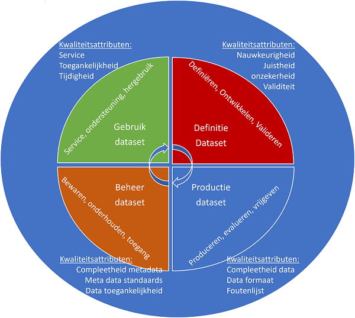

Bijlagen
========

Data, datasets en metadata
--------------------------

De uitwisseling van gegevens staat bij het DSGO centraal. Dat uitwisselen kan
eenmalig, herhaaldelijk of continu zijn, maar wat bedoelen we hier met gegevens?
Voor een digitaal stelsel gebouwde omgeving zijn er drie termen essentieel
wanneer we het hebben over gegevens of *data*.

**Data** zijn die gegevens die over het gebouwde object beschrijven. Dat kan
bijvoorbeeld een bouwtekening zijn, een inspectierapport of een rapportage van
het energiegebruik. Deze gegevens zijn in verschillende formaten beschreven,
waarbij sommige formaten leesbaar zijn voor zowel mens en computer (zoals een
PDF-inspectierapport), maar niet altijd interpreteerbaar voor een
computersysteem. Data kan gestructureerd of ongestructureerd zijn. Hoe
gestructureerder een bestand, hoe meer mogelijkheden het biedt in een digitale
omgeving. Het heeft daarom de voorkeur om zo’n inspectierapport als spreadsheet
ook voor de computer leesbaar aan te bieden. Dan kan een computersysteem wel de
tabel met gebreken ‘zien’ en interpreteren.

Data is een representatie van observaties, objecten of andere entiteiten uit de
werkelijkheid. Denk aan het bouwobject dat door het process van plan en
vergunningverlening, tot realisatie en beheer, heengaat. Data refereert naar
iets dat is verzameld, geobserveerd, gegenereerd of afgeleid. Data wordt door de
mens gebruikt als een basis om te redeneren, discussieren of calculeren.

**Metadata** zijn gegevens die de karakteristieken van bepaalde gegevens
beschrijven. Het zijn dus eigenlijk data over data. De metadata bij een bepaald
document (de gegevens) kunnen bijvoorbeeld zijn: de auteur, de datum van
schrijven, de uitgever, het aantal pagina's en de taal waarin de gegevens zijn
opgesteld. De metadata helpt mens en computer bij het vinden van de juiste
gegevens en bij het juist interpreteren van het document. Bij een bouwtekening
beschrijft metadata welke schaal is gebruikt, wie de tekenaar was, welke versie
van de tekening dit is en wanneer deze versie is opgeleverd. Dat staat dan ook
vaak in de rechter onderhoek, maar ook het digitale bestand van de tekening
bevat deze gegevens op een vaste plek. Bij een inspectierapport zijn
gebruikelijke metadata het geïnspecteerde object, de inspecteur, de datum van de
inspectie. In PDF-vorm staat dat dan op de voorkant van het rapport, maar in het
voor de computer leesbare bestand staat dat eveneens opvaste plekken. Bij een
energierapport zijn metadata informatie over de EAN-aansluiting, maar ook
misschien adres of netbeheerder of vergelijking met andere gebruikers.

Het op een gestructureerde en afsgeproken manier van toevoegen van metadata aan
data heeft als resultaat dat data vindbaar en doorzoekbaar is. Denk daarbij aan
de systematiek van bibliotheken en archieven.

De scheidslijn tussen metadata en data zelf is soms lastig te trekken. Wat voor
de ene toepassing randzaken zijn, kan centraal staan in de andere. Bijvoorbeeld
om vergelijkingen tussen tekeningen van een verschillende schalen te maken of om
door de energiebesparende suggesties uit het inspectierapport te vergelijken met
het daadwerkelijke verbruik. Daarom is het belangrijk zowel juiste data als
metadata te verzamelen.

De interpretatie van gegevens is afhankelijk van het bestandsformaat waarin het
is opgeslagen. Een PDF-bestand is slecht interpreteerbaar voor een
computersysteem: slechts de titel en auteur van het document staat op een vaste
plek bewaard. Een spreadsheet daarentegen kan worden genavigeerd, met vaste
cellen voor bepaalde informatie. Andere bestandsformaten, zoals XML of linked
data-talen, zijn nog meer zelfbeschrijvend. Deze formaten kunnen een
interpretatieschema toevoegen aan de data, zodat een computersysteem zelf kan
achterhalen waar de relevante informatie staat.

Een **dataset** is de derde en laatste data-gerelateerde term. Een dataset is
een identificeerbare verzameling van data die als een geheel kan worden
verwerkt, bewerkt en gepubliceerd door een enkel subject. Een verzameling van
datasets kan ook op zich weer een dataset zijn. Bijvoorbeeld de verzamelde
gegevens vanuit de verschillende disciplines die opgenomen worden in een
*dossier bevoegd gezag* zijn elk een dataset. Het dossier bevoegd gezag, wordt
gevormd door de verzameling van deze datasets en is zelf ook een dataset.

Data en datasets ontstaan niet zomaar. Ze kennen een **levenscyclus**. Deze
levenscyclus van de dataset is samen te vatten in vier fasen, geillustreerd door
figuur ‘Levenscyclus van de dataset’:

1.  Definitie: in deze fase is de dataset gedefinieerd en krijgt ze betekenis.
    Van belang is dat het algoritme de juiste data voortbrengt zodat de inhoud
    van de dataset overeenkomst met zoals deze vooraf gedefinieerd was. De
    ontwikkelaar van een dataset is daarmee verantwoordelijk voor de juistheid
    van de inhoud.

2.  Productie: in deze fase wordt de dataset geproduceerd. In deze fase is
    bepalend dat de dataset volledig en in het juiste formaat wordt vrijgegeven.
    De producent van de dataset is verantwoordelijkheid voor de volledigheid van
    de dataset.

3.  Beheer: in deze fase wordt de dataset beheerd. In deze fase is bepalend hoe
    goed de dataset wordt bewaard, voorzien van metadata en toegankelijk
    gemaakt. De beheerder van de dataset is verantwoordelijk voor de metadata
    van de dataset.

4.  Gebruik: in deze fase wordt de data gebruikt. In deze fase is bepalend hoe
    goed de dataset als service ter beschikking wordt gesteld en ondersteund en
    herbruikbaar is. De exploitant van de dataset is verantwoordelijk voor het
    ondersteunen van het gebruik van de dataset.

**Figuur: Levenscyclus van de dataset**

Sommige datasets zijn contractueel afgesproken, (tegenwoordig meer en meer via
Informatieleveringsspecificaties, afgekort ILS’en) zoals een bouwtekeningen,
modellen, berekeningen en inspectierapporten bij het voltooien van een bepaalde
bouwfase. Of het halfjaarlijks update van een kaart met verschillende kaartlagen
met gekoppelde informatie van een beheerd areaal. De dataset komt daarmee vaak
overeen met een dossier. Door een afgesproken structuur is een dataset voor de
computer een samenhangende set van bestanden.

Er is in de zin van DSGO niet een minimale (laat staan maximale) grootte van een
dataset. Uit praktische overwegingen zijn er misschien wel beperkingen, maar
door technologische ontwikkelingen speelt dat steeds minder een rol. Om data
(gegevens) of datasets (gegevensets) met/ binnen het DSGO uit te wisselen gaat
het niet zozeer over de grootte van een dataset maar juist overover de
vindbaarheid, toegankelijkheid, herbruikbaarheid en uitwisselbaarheid. Dat komt
overeen met het maken van afspraken op basis van de FAIR-uitgangspunten.

Ontwerpprincipes
-----------------
De ontwerpprincipes zijn:

1.  *Open en transparant*: dit principe slaat zowel op de ontwikkeling
    van het DSGO als de uitkomst ervan. Ontwerpproces: namelijk dat dit in een
    open en transparant proces ontwikkeld wordt, waarbij alle belanghebbenden
    inzicht krijgen en invloed hebben op de ontwikkeling. Uitkomsten: Data,
    algoritmen en technologie zijn navolgbaar, herleidbaar en begrijpelijk. Voor
    de onderliggende ingrediënten geldt dat ze openbaar, vindbaar, toegankelijk,
    uitwisselbaar, herbruikbaar en controleerbaar moeten zijn (FAIR ).

2.  Inclusief *betrekken* van alle *belanghebbenden* in de processen die
    ondersteund worden door het DSGO, met bijzondere aandacht voor de positie
    van burgers.

3.  *Rechtvaardig ontwerpen* en toepassen van de spelregels voor alle
    belanghebbenden, zodat recht gedaan wordt aan hun belang.

4.  *Doelgerichtheid*: doorleven, beoordelen en waarderen van de toepasbaarheid
    en doeltreffendheid van het DSGO, de onderliggende (nieuwe) data, algoritmen
    en gebruikte technologie, voor alle processen die het DSGO ondersteunt.

5.  *Betrokkenheid*: Inrichten en operationaliseren van een werkwijze waarbij
    alle belanghebbenden, inclusief het ‘publiek belang’, betrokken worden
    inclusief de naleving daarvan.

6.  *Controleerbaarheid*: Organiseren van menselijke controle en
    interventiemacht in geautomatiseerde beeld-, oordeels- en
    besluitvormingsprocessen.

7.  *Soevereiniteit*: Alloceren van eigenaarschap, zeggenschap en controle over
    gebruikte data en algoritmen (soevereiniteit).

8.  *Informatieveiligheid*: Voor het DSGO is het belangrijk dat traceerbaar is
    van wie gegevens afkomstig zijn, of de bron ze gewijzigd of verrijkt heeft
    (transparantie en provenance) en dat ze tussen creatie en uitlevering niet
    gemanipuleerd zijn (integriteit). Voor alle belanghebbenden is het
    essentieel dat data juist, volledig en actueel zijn.

Dataprincipes
--------------
De dataprincipes zijn:

- *Findable (vindbaar)* De eerste stap bij het (her)gebruiken van data is om de
data te vinden. Metadata en data moeten gemakkelijk te vinden zijn voor zowel
mensen als computers. Machine-readable metadata zijn essentieel voor het
ontdekken van datasets en services.

- *Accessible (toegankelijkheid)* Zodra de gebruiker de benodigde gegevens heeft
gevonden, moet hij/zij weten hoe deze kunnen worden geraadpleegd, inclusief
authenticatie en autorisatie. Laagdrempelig in gebruik.

- *Interoperable (uitwisselbaar)* De gegevens moeten meestal worden geïntegreerd
met andere gegevens. Bovendien moeten de gegevens samenwerken met applicaties of
workflows voor analyse, opslag en verwerking.

- *Reusable (herbruikbaar)* Het uiteindelijke doel van FAIR is het hergebruik
van data te optimaliseren. Om dit te bereiken moeten metadata en data goed
worden beschreven, zodat ze in verschillende situaties kunnen worden
gerepliceerd en/of gecombineerd.

Uitgangspunten, randvoorwaarden en eisen
----------------------------------------
De in hoofdstukken vier en vijf benoemde uitgangspunten, randvoorwaarden en eisen zijn in deze paragraaf samengevat. 

**Publiek waarden**

*Open en transparant*
- Randvoorwaarde: Alle betrokkenen bij een use case bespreken de ontwerpprincipes, om concreet te maken wat deze voor een use case betekenen. De keuzes die hieruit volgen worden vastgesteld en ingericht, bijgesteld en zo lerend ontwikkeld, zodat anderen daarop kunnen voortbouwen. 
Open en transparante uitkomsten
- Eis: Usecases leggen voor elke data(set) die tussen partijen uitgewisseld wordt, vast wat de oorsprong van deze dataset is en welke bewerkingen deze heeft ondergaan.

*Inclusiviteit*
- Randvoorwaarde: Maak de ontwikkeling van het DSGO inclusief, zodat er geen groepen worden buitengesloten door de manier waar op de afspraken gemaakt worden over het delen van data. De belangen van alle stakeholders zijn in beeld bij elke use case. De inzet van een onafhankelijk voorzitter is daarbij een aanrader.

*Rechtvaardigheid*
- Eis: Ontwerp elke use case binnen het DSGO rechtvaardig, zodat alle belanghebbenden een eerlijke en volledige weergave van de feiten kunnen inzien. 

*Doelgerichtheid*
- Eis: Ontwerp elke use case binnen het DSGO doelgericht, zodat de uit te wisselen data geschikt en voldoende is voor het doel, waarvoor de informatie nodig is. 

*Betrokkenheid*
- Randvoorwaarde: Voor elke use case worden de afspraken met alle direct betrokkenen gemaakt en vastgelegd. Dat geldt in het bijzonder voor partijen die de data ter beschikking stellen.

*Controleerbaarheid*
- Eis: Ontwerp elke use case zo dat er kan worden ingegrepen in de geautomatiseerde processen. 

*Soevereiniteit*
- Uitgangspunt: Binnen het DSGO wordt bepaald welke belanghebbende (in juridische termen natuurlijke persoon of rechtspersoon) eigenaar is en/of zeggenschap en controle uitoefent over en/of gebruik maakt van de data(set), standaard, algoritme of voorziening die van belang zijn binnen de use cases. Met deze belanghebbenden kunnen vervolgens afspraken worden gemaakt om de data(set), standaard, algoritme of voorziening FAIR te kunnen (her)gebruiken.
- Uitgangspunt: Samen met de sector co-creëren van een samenhangende set afspraken op business, functioneel, operationeel, juridisch en technisch gebied, om gemakkelijker gebruik te kunnen maken van elkaars data.

*Informatieveiligheid*
- Eis: Binnen het DSGO worden maatregelen getroffen om de integriteit te waarborgen.
- Eis: Het DSGO voorziet in autorisatie- en authenticatiemogelijkheden, zodat alleen de rechthebbenden inzage krijgen in de data(sets) die uitgewisseld worden. 
- Eis: Het DSGO geeft transparant weer wat de bron is van elke dataset en welke bewerkingen deze heeft ondergaan en/of aan welke kwaliteitseisen deze voldoet in termen van actualiteit, volledigheid en juistheid), zodat de eindgebruiker de betrouwbaarheid kan vaststellen.

**Dataprincipes**

*Vindbaar*
- Uitgangspunt: Het DSGO is een set uniforme afspraken voor de uitwisseling van gegevens over de gebouwde omgeving tussen organisaties, en geen landelijk registratiesysteem.
- Uitgangspunt: Het DSGO beschrijft de afspraken waaronder de toegang tot de datasets bij de bron wordt verleend, de toegang wordt bij de bron bepaald. Het DGSO catalogiseert metadata die de datasets beschrijven.
- Eis: De data die het DSGO ontsluit, zijn identificeerbaar aan de hand van een UOI. Elke dataset verwijst/beschrijft naar één of meerdere UOI's en is zelf ook uniek identificeerbaar aan de hand van een persistente identifier. Ook metadata krijgt zo'n unieke en persistente identifier. Persistent betekent dat maar één ding zo'n identifier krijgt en dat een ding die identifier z'n hele levensloop behoudt.
- Eis: Van elk gegeven in het DSGO is meta-informatie over onder meer de herkomst, kwaliteit, status en gebruik (licentie en toepassing) beschikbaar. De wijze van metadatering sluit aan bij vigerende (inter)nationale standaarden voor informatiemanagement en metadata. Ook de wijze van toegang, de gebruikte gegevensformaten en schema’s worden beschreven in de metadata van een dataset.
- Eis: Bij de metadata(set) wordt de unieke identificatie (UOI) van de betreffende data(set) opgenomen.
- Eis: Het DSGO fungeert onder meer als een doorzoekbare catalogus c.q. register met gedistribueerde data(sets) over de gebouwde omgeving. Bijvoorbeeld Gebouwdossier (Digitaal Dossier Bevoegd Gezag - DDBG), Energie labels, en geo-basisregistraties.

*Toegankelijk*
- Uitgangspunt: Gegevens worden in het DSGO aangeboden op basis van de bestaande (semantische) standaarden. Vanuit DSGO kan dit als randvoorwaarde worden geformuleerd aan broneigenaren die hun data(sets) via DSGO wensen te ontsluiten.
- Uitgangspunt: In het DSGO verloopt de authenticatie van natuurlijke personen en (overheids)organisaties met een publieke taak zich middels DigiD, van bedrijven middels eHerkenning. 
- Eis: Voor het DSGO zijn (vooral) afspraken nodig over de technische uitwisseling van (meta)data(sets) op de koppelvlakken, ofwel op de interfaces tussen de systemen, om de data te laten stromen.
- Eis: De toegang tot het DSGO wordt geboden middels een open, gratis en universeel toepasbaar protocol.
- Eis: Het DSGO houdt een duurzame metadataregistratie bij, waarbij metadata langdurig bewaard en toegankelijk blijft. De datasets zelf worden niet noodzakelijk door DSGO bewaard.

*Uitwisselbaar*
- Uitgangspunt: Elke dataset beschrijft het informatiemodel of ontologie waarmee de data is beschreven. Als die niet aanbevolen is door Forum Standaardisatie of het BIM Loket, moet het uitgangspunt zijn dat ze publiekelijk te raadplegen zijn.
- Randvoorwaarde: Het DSGO helpt koppelingen te realiseren tussen datasets, belegd bij de metadataredacteur. 
- Eis: Datasets worden aangeboden in standaarden die zijn aanbevolen door Forum Standaardisatie of door het BIM Loket. 
- Eis: De eigenaar van de (meta)data(set) is zelf verantwoordelijk voor een goede kwaliteit van de (meta)data(set).

*Herbruikbaar*
- Uitgangspunt: Het DSGO geeft gerapporteerde onjuistheden en onvolkomenheden door aan de eigenaars. DSGO biedt API's en formulieren aan voor eindgebruikers om rapportages zo eenvoudig mogelijk te maken.
- Uitgangspunt: In het DSGO worden Standaarden uit verschillende domeinen toegepast. Het is onmogelijk om al deze standaarden te harmoniseren op semantiek. Daarom stellen we de open standaarden van het BIM Loket en het Forum Standaardisatie als uitgangspunt.
- Randvoorwaarde: De leveranciers en de metadataredacteur zetten zich in voor een hoge kwaliteit data. Het platform kan statistieken gebruiken om de metadataredacteur te ondersteunen in haar/zijn werk. 
- Eis: De data en de metadata dienen van hoge kwaliteit te zijn en voldoen aan een hoge mate van nauwkeurigheid. 
- Eis: Elke gegevensset beschrijft de gebruikslicentie ervan. Minstens op een voor mensen leesbare wijze, bij voorkeur met (een link naar) een machineleesbare representatie.
- Eis: Het platform en de datasetaanbieders houden zorgvuldig bij waar welk gegevenspunt vandaan komt.

Geraadpleegde bronnen
---------------------

-   _Actieplan Digitaal Stelsel Gebouwde Omgeving - Afspraken over toegang tot data_. Versie 1.0 mei 2021;
-   _Afsprakenstelsels in de praktijk - Leerervaringen van afsprakenstelsels om te komen tot een uniforme set van eisen voor persoonlijk datamanagement_. Programma Regie op Gegevens, september 2018;
-   _Opwaarderen - Borgen van publieke waarden in de digitale samenleving_, Rathenau instituut 2017;
-   _Op weg naar een health data infrastructuur en afsprakenstelsel_ - Adviesrapport van Nederlandse AI Coalitie, over de Health data infrastructuur en afsprakenstelsel in Nederland. Versie 1.0 juli 2020;
-   _Routekaart Digitale Toekomst_, Waag technology&society. Versie 0.3 april 2020;

