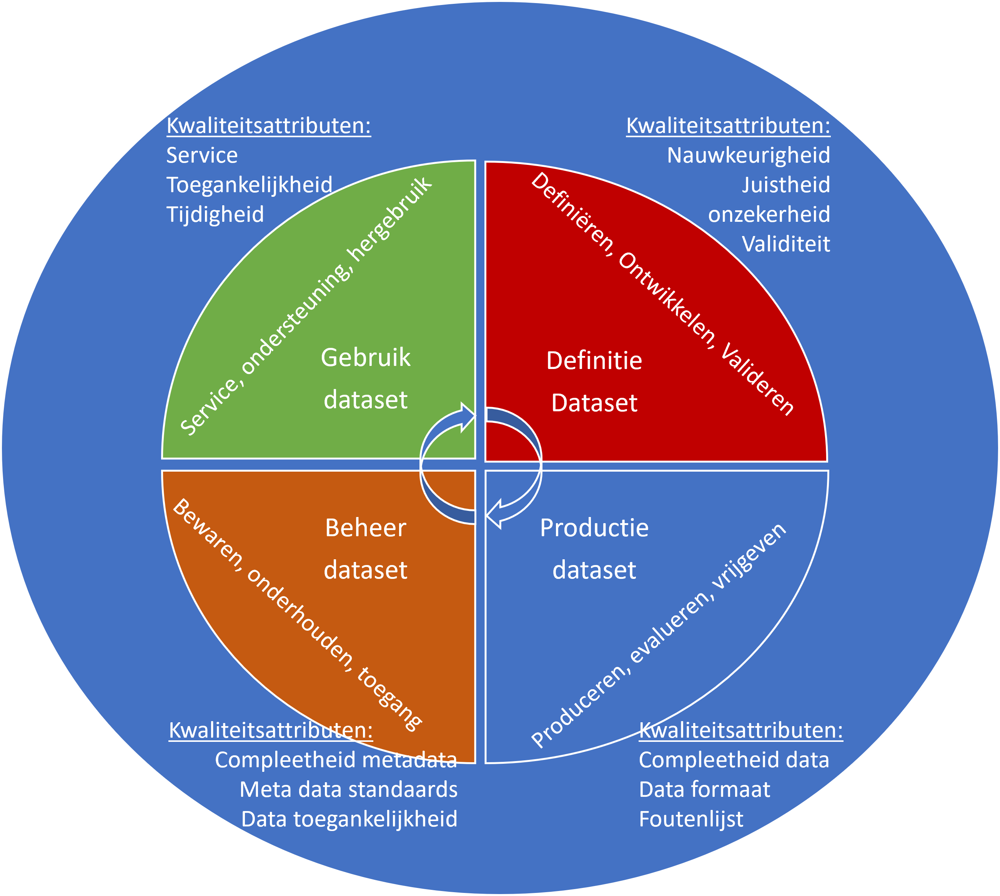

Data, datasets en metadata
--------------------------

De uitwisseling van gegevens staat bij het DSGO centraal. Dat uitwisselen kan
eenmalig, herhaaldelijk of continu zijn, maar wat bedoelen we hier met gegevens?
Voor een digitaal stelsel gebouwde omgeving zijn er drie termen essentieel
wanneer we het hebben over gegevens of *data*.

**Data** zijn die gegevens die over het gebouwde object beschrijven. Dat kan
bijvoorbeeld een bouwtekening zijn, een inspectierapport of een rapportage van
het energiegebruik. Deze gegevens zijn in verschillende formaten beschreven,
waarbij sommige formaten leesbaar zijn voor zowel mens en computer (zoals een
PDF-inspectierapport), maar niet altijd interpreteerbaar voor een
computersysteem. Data kan gestructureerd of ongestructureerd zijn. Hoe gestructureerder een bestand, hoe meer
mogelijkheden het biedt in een digitale omgeving. Het heeft daarom de voorkeur om
zo’n inspectierapport als spreadsheet ook voor de computer leesbaar aan te bieden. Dan kan een
computersysteem wel de tabel met gebreken ‘zien’ en interpreteren.

Data is een representatie van observaties, objecten of andere entiteiten uit de werkelijkheid. Denk aan het bouwobject dat door het process van plan en vergunningverlening, tot realisatie en beheer, heengaat. Data refereert naar iets dat is verzameld, geobserveerd, gegenereerd of afgeleid. Data wordt door de mens gebruikt als een basis om te redeneren, discussieren of calculeren.

**Metadata** zijn gegevens die de karakteristieken van bepaalde gegevens beschrijven. Het zijn dus eigenlijk data over data. De metadata bij een bepaald document (de gegevens) kunnen bijvoorbeeld zijn: de auteur, de datum van schrijven, de uitgever, het aantal pagina's en de taal waarin de gegevens zijn opgesteld.
De metadata helpt mens en computer bij het vinden van de juiste gegevens en
bij het juist interpreteren van het document. Bij een bouwtekening beschrijft
metadata welke schaal is gebruikt, wie de tekenaar was, welke versie van de
tekening dit is en wanneer deze versie is opgeleverd. Dat staat dan ook vaak in
de rechter onderhoek, maar ook het digitale bestand van de tekening bevat deze
gegevens op een vaste plek. Bij een inspectierapport zijn gebruikelijke
metadata het geïnspecteerde object, de inspecteur, de datum van de
inspectie. In PDF-vorm staat dat dan op de voorkant van het rapport, maar in het voor de computer leesbare bestand staat dat eveneens opvaste plekken. Bij een energierapport
zijn metadata informatie over de EAN-aansluiting, maar ook misschien adres
of netbeheerder of vergelijking met andere gebruikers.

Het op een gestructureerde en afsgeproken manier van toevoegen van metadata aan data heeft als resultaat dat data vindbaar en doorzoekbaar is. Denk daarbij aan de systematiek van bibliotheken en archieven. 

De scheidslijn tussen metadata en data zelf is soms lastig te trekken. Wat voor
de ene toepassing randzaken zijn, kan centraal staan in de andere. Bijvoorbeeld
om vergelijkingen tussen tekeningen van een verschillende schalen te maken of om
door de energiebesparende suggesties uit het inspectierapport te vergelijken met
het daadwerkelijke verbruik. Daarom is het belangrijk zowel juiste data als
metadata te verzamelen.  

De interpretatie van gegevens is afhankelijk van het bestandsformaat waarin het
is opgeslagen. Een PDF-bestand is slecht interpreteerbaar voor een
computersysteem: slechts de titel en auteur van het document staat op een vaste
plek bewaard. Een spreadsheet daarentegen kan worden genavigeerd, met vaste
cellen voor bepaalde informatie. Andere bestandsformaten, zoals XML of linked data-talen,
zijn nog meer zelfbeschrijvend. Deze formaten kunnen een interpretatieschema
toevoegen aan de data, zodat een computersysteem zelf kan achterhalen waar de
relevante informatie staat.

Een **dataset** is de derde en laatste data-gerelateerde term. Een dataset is een identificeerbare verzameling van data die als een geheel kan
worden verwerkt, bewerkt en gepubliceerd door een enkel subject. 
Een verzameling van datasets kan ook op zich weer een dataset zijn.
Bijvoorbeeld de verzamelde gegevens vanuit de verschillende disciplines die opgenomen worden in een _dossier bevoegd gezag_ zijn elk een dataset. Het dossier bevoegd gezag, wordt gevormd door de verzameling van deze datasets en is zelf ook een dataset.

Data en datasets ontstaan niet zomaar. Ze kennen een **levenscyclus**.
Deze levenscyclus van de dataset is samen te vatten in vier fasen,
geillustreerd door figuur ‘Levenscyclus van de dataset’:

1.  Definitie: in deze fase is de dataset gedefinieerd en krijgt ze betekenis. Van belang is dat het algoritme de juiste data voortbrengt zodat de inhoud van de dataset overeenkomst met zoals deze vooraf gedefinieerd was. 

2.  Productie: in deze fase wordt de dataset geproduceerd. In deze fase is bepalend dat de dataset volledig en in het juiste formaat wordt vrijgegeven. 

3.  Beheer: in deze fase wordt de dataset beheerd. In deze fase is bepalend hoe goed de dataset wordt bewaard, voorzien van metadata en toegankelijk gemaakt.

4.  Gebruik: in deze fase wordt de data gebruikt. In deze fase is bepalend hoe goed de dataset als service ter beschikking wordt gesteld en ondersteund en herbruikbaar is.

**Figuur: Levenscyclus van de dataset**

Sommige datasets zijn contractueel afgesproken, (tegenwoordig meer en meer via Informatieleveringsspecificaties, afgekort ILS’en) zoals een
bouwtekeningen, modellen, berekeningen en inspectierapporten bij het voltooien van een bepaalde
bouwfase. Of het halfjaarlijks update van een kaart met verschillende kaartlagen met gekoppelde informatie van een
beheerd areaal. De dataset komt daarmee vaak overeen met een dossier. Door een afgesproken structuur is een dataset voor de computer een samenhangende set van bestanden. 

Er is in de zin van DSGO niet een minimale (laat staan maximale) grootte van een
dataset. Uit praktische overwegingen zijn er misschien wel beperkingen, maar door technologische ontwikkelingen speelt dat steeds minder een rol. Om data (gegevens) of datasets (gegevensets) met/ binnen het DSGO uit te
wisselen gaat het niet zozeer over de grootte van een dataset maar juist overover de vindbaarheid, toegankelijkheid,
herbruikbaarheid en uitwisselbaarheid. Dat komt overeen met het maken van afspraken op basis van de
FAIR-uitgangspunten.
