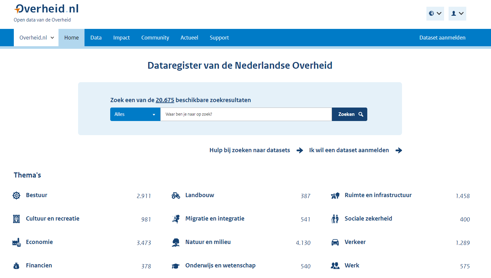
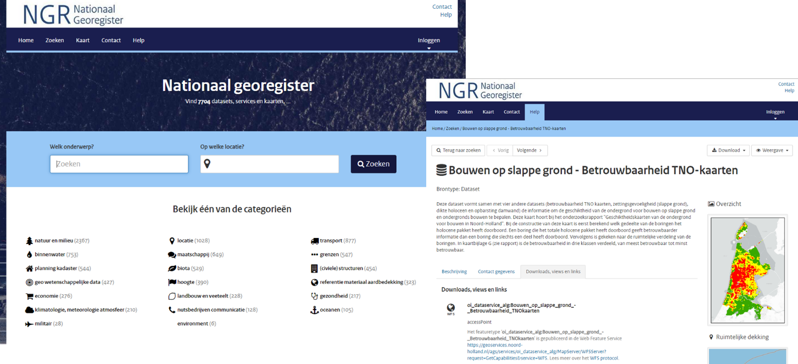

Dataprincipes
=============

Centraal in de definitie van het DSGO staat
de veilige, betrouwbare en gecontroleerde toegang tot data in de bouwsector. Om
deze toegang tot data te realiseren is een set van uniforme afspraken nodig. In
dit hoofdstuk gaan we in op welke afspraken (‘wat’) vanuit publiek belang
minimaal nodig zijn om *data voor de bouwsector te laten stromen*, met de volgende achterliggende vragen.

Welke afspraken zijn nodig om databronnen over de gebouwde omgeving te
ontsluiten? Welke principes pas je toe om gecontroleerde toegang tot deze
bronnen te geven? Welke afspraken zijn er op technisch en organisatorisch vlak
nodig om er voor te zorgen dat gegevens tussen verschillende organisaties die
opereren in het stelsel, uitgewisseld kunnen worden? Welke principes pas je toe
om de veiligheid van de gegevens in het stelsel te waarborgen, ook met het oog
op eigendom en privacy? En dat de gegevens (her)bruikbaar zijn: aansluiten bij
de behoefte zowel vraag als aanbod van de verschillende organisaties?

Ontwerpprincipes
----------------

De ontwerpprincipes voor (meta)data(sets) in het DSGO worden 
beschreven aan de hand van de FAIR-principes: *Findable* (vindbaar),
*Accessible* (toegankelijk), *Interoperable* (uitwisselbaar) en *Reusable*
(herbruikbaar).

We hanteren de term *(meta)data(sets)* omdat de dataprincipes van toepassing
kunnen zijn op [data, metadata, een dataset, en/of metadataset](#data-datasets-en-metadata).

De FAIR principes zijn nader onderverdeeld in subprincipes; deze zijn geletterd
en genummerd, aan de hand waarvan ze worden beschreven in de volgende
paragrafen.

### Vindbaar

De eerste stap bij het (her)gebruiken van data is om de data te vinden. Metadata
en data moeten gemakkelijk te vinden zijn voor zowel mensen als computers.
Machineleesbare metadata zijn essentieel voor het ontdekken van datasets en
services. Vindbaarheid begint met bekendheid om te weten dat data gevonden kan
worden. Hiervoor is communicatie over het DSGO-uitgangspunt en een centraal
loket voor vragen, essentieel. Voor het vindbaar maken van data is het niet noodzakelijk afspraken te maken. 

**F1. Elke (meta)data(set) krijgt een wereldwijd unieke en persistente
identifier**

De vindbaarheid van data wordt vergroot als deze altijd op dezelfde plek is
terug te vinden. Bijvoorbeeld een dataset is altijd te downloaden vanaf dezelfde
weblocatie, of een app stuurt altijd een HTTP-request naar een API of webservice
met dezelfde basis-URL.

Bij uitwisseling van data tussen systemen op verschillende fysieke plekken,
ofwel gedistribueerde systemen, is het dus van belangrijk dat de technische
aanduiding, ofwel identificatie van data of een dataset *uniek* en *persistent*
(blijvend) is.

*Uniek* betekent dat er een mechanisme voor identificatie wordt gehanteerd waardoor er altijd een uniek ID wordt (uit)gegeven. Het toekennen van een identificatie aan een (meta)data(set) kan centraal door een uitgiftesysteem voor identificaties of decentraal bij dataleverancier op basis van specifieke regels/patronen.

*Persistent* betekent dat de identificatie van een (meta)data(set) gedurende de levensloop/-cyclus behouden blijft.

Zodoende zijn datasets of informatie over datasets door de tijd heen *vindbaar* en
*citeerbaar*, ongeacht de status, beschikbaarheid of het [formaat van de data](https://www.w3.org/TR/dwbp/#UniqueIdentifiers).

Een unieke identificatie maakt mogelijk om (meta)data(sets) ‘as-is’ aan elkaar te koppelen/relateren. Deze (meta)data(sets) mogen heterogeen zijn. Koppelingen/relaties maken semantisch knelpunten inzichtelijk en kunnen op later moment naar behoefte worden opgelost (harmoniseren/integreren).

>   Voorbeeld: In Nederland (en internationaal) wordt gewerkt aan het [Unieke Object
>   Identificator
>   (UOI)](https://www.geonovum.nl/over-geonovum/actueel/onderzoek-unieke-object-identificatie-en-omgevingsinformatie) systeem
>   voor toegang tot informatie over een nieuwe en bestaande bouwwerken of de gebouwde
>   omgeving die in verschillende databases zijn opgeslagen. Het UOI dient als een
>   digitale sleutel waarmee je op basis van je rol en toegangsrechten informatie
>   over bouwwerken en objecten in de gebouwde omgeving kunt raadplegen. Daarmee kan
>   bijvoorbeeld specifieke informatie over een gebouw, verdieping, kamer of raamkozijn worden
>   geraadpleegd op basis van [rollen en toegangsrechten](https://fibree.org/uoi-nl/).
>   
>   Het ‘systeem’ als gedachte is ontwikkeld binnen de bouw- en vastgoedsector. De
>   gedachte achter een UOI-code is dat er domeinoverstijgend verbindingen mee
>   gelegd kunnen worden die het beantwoorden van vragen over objecten in de
>   gebouwde omgeving vereenvoudigen. De UOI-code wordt ook genoemd in de lopende
>   consultatie van de [Samenhangende Objecten Registratie
>   (SOR)](https://www.geobasisregistraties.nl/basisregistraties/doorontwikkeling-in-samenhang/objectenregistratie).
>   Experts uit de bouw- en geo-wereld hebben het UOI als systeem getoetst aan de
>   nieuwe Geo- & Bouw-informatiestandaarden (NEN 3610, NEN 2660 en BIM gerelateerde
>   standaarden) en de [principes die DiSGeo
>   hanteert](https://docs.geostandaarden.nl/disgeo/emso/#identificatie-van-objecten) voor
>   de Samenhangende Objecten Registratie (SOR). Ook is gekeken naar de instrumenten
>   van de Wet kwaliteitsborging Bouw (Wkb) en het ontwerp Digitaal Stelsel Gebouwde
>   Omgeving DSGO (binnen digiGO).

Noot van de schrijvers: Tussen november 2020 en april 2021 heeft het
ministerie van BZK onderzoek laten doen naar het ontwerp van een Unieke Object
Identificatie (UOI). Vraag aan Geonovum was de UOI te verkennen in relatie tot
standaarden in de bouw- en geo-sector en de ontwikkelingen rond
objectidentificatie in de fysieke leefomgeving. Ten tijde van het schrijven dit
rapport is er een concept onderzoeksrapport over UOI.

>   **Eis:** De data die het DSGO ontsluit, zijn identificeerbaar aan de hand
>   van een
>   [UOI](https://www.geonovum.nl/over-geonovum/actueel/onderzoek-unieke-object-identificatie-en-omgevingsinformatie).
>   Elke dataset verwijst/beschrijft naar één of meerdere UOI's en is zelf
>   ook uniek identificeerbaar aan de hand van een persistente identifier. Ook
>   metadata krijgt zo'n unieke en persistente identifier. Persistent betekent
>   dat maar één ding zo'n identifier krijgt en dat een ding die identifier z'n
>   hele levensloop behoudt.

**F2. Gegevens worden beschreven met uitgebreide metadata**

Metadata zijn gegevens over de data zelf. Voorbeelden van metadata zijn de
contactgegevens van de organisatie die de gegevens beschikbaar stelt (herkomst),
gegevens over hoe de informatie is ingewonnen en met welke kwaliteit, of
gegevens over het intellectueel eigendom en toepassing om de data voor bepaalde
toepassingen te gebruiken (licentie).
In de [NEN-EN-ISO 19650-serie](https://www.bimloket.nl/p/269/NEN-EN-ISO-19650), de internationale normenserie voor (digitaal) 
informatiemanagement in de levenscyclus van bouwwerken, wordt ervan uitgegaan dat 
projectpartners in een projectcontext data(sets) uitwisselen via een Common Data 
Environment (CDE). 
De omschrijving van CDE in de normenserie is zodanig, dat het 
kan gaan om zowel een centraal als een gedistribueerd systeem. In een situatie 
waarin informatie over een bouwwerk in een itererend proces met verschillende 
projectpartners wordt ontwikkeld, is accurate metadata over de status van data(sets) 
die op de CDE worden geplaatst, essentieel. Volgens de [NEN-EN-ISO 9001](https://www.nen.nl/managementsystemen/kwaliteitsmanagement-iso-9001) moet daarbij
onderscheid worden gemaakt naar:
- werk in uitvoering;
- informatie/data die is vrijgegeven om te delen met andere projectpartners;
- informatie/data die is vrijgegeven voor gebruik in een volgende projectfase of voor asset management;
- gearchiveerdee informatie/data. 

>   **Eis:** Van elk gegeven in het DSGO is meta-informatie over onder meer de
>   herkomst, kwaliteit, status en gebruik (licentie en toepassing) beschikbaar. De wijze
>   van metadatering sluit aan bij vigerende (inter)nationale standaarden voor informatiemanagement en 
>   metadata. Ook de wijze van toegang, de gebruikte gegevensformaten en
>   schema’s worden beschreven in de metadata van een dataset.

**F3. Metadata bevatten duidelijk en expliciet de identifier van de gegevens die
ze beschrijven**

Metadata zijn gegevens over de data zelf. Metadata beschrijft dus de dataset. Om te
weten welke metadata(set) hoort welke data(set) moet een expliciete relatie
vastgelegd worden tussen de metadata(set) en data(set). Dit kan door het opnemen
van de identificatie van de data(set) in de metadata(set).

>   **Eis:** Bij de metadata wordt de unieke identificatie (UOI) van de
>   betreffende data(set) opgenomen.
>
> 

> 
> De informatiekundige relatie is dus ‘Metadata(set) beschrijft 0..\*
> data(set)’ en niet ‘Data(set) wordt beschreven in 0..\* Metadata(sets)’
> 
> 

**F4. (Meta)data worden geregistreerd of geïndexeerd in een doorzoekbare bron**

Voor het DSGO gaan we er vanuit dat het een set met uniforme afspraken is voor
de uitwisseling van data, en niet een centraal registratiesysteem (à la
landelijke voorziening) waarin alle data zijn opgeslagen. (Meta)data(sets)
worden opgeslagen in de systemen van de organisaties die de data creëren, lezen,
updaten of verwijderen (CRUD), en worden beschikbaar gesteld vanuit hun
bronsysteem aan andere partijen in het DSGO volgens de centrale en bilaterale
afspraken.

Dit uitgangspunt past bij het [Common Ground](https://commonground.nl/)-principe
van bevragen van ‘data bij de bron’. Het ‘bevragen bij de bron’ voorkomt het
veelvuldig kopiëren en opslaan van dezelfde gegevens op verschillende plekken.
Bij het veelvuldig kopiëren en opslaan van dataset kunnen de kopieën in systemen
in de tijd uit de pas gaan lopen (asynchroniteit) wat kan leiden tot
verschillende resultaten (inconsistenties) bij het gebruik van deze gegevens.
In een projectcontext kan het kopiëren en decentraal opslaan van datasets ertoe 
leiden dat projectpartners voortborduren op inmiddels verouderde informatie (een
veel voorkomende oorzaak van faalkosten in de bouw).

Het uitgangspunt van ‘data bij de bron’ wordt ook gehanteerd in de [Beleidsvisie
Samenhangende
Objectenregistratie](https://www.geobasisregistraties.nl/documenten/beleidsnota/2019/11/29/beleidsvisie-samenhangende-objectenregistratie) 
van het ministerie van BZK en successievelijk de
[architectuurprincipes](https://docs.geostandaarden.nl/disgeo/arch/) voor de
Nederlandse Geo-Informatie Infrastructuur (NGII).

“Er wordt in de eindsituatie zoveel mogelijk uitgegaan van ‘bevragen bij
de bron’. Hierbij is van belang dat de gebruiker voor verstrekkingen zoveel
mogelijk uit kan gaan van één loket. Een belangrijk aandachtspunt hierbij is het
gebeurtenis georiënteerd werken (nader uit te werken). Of de bronhouders
gedistribueerd en decentraal werken of direct inwinning en bijhouding in een (of
meerdere) voorziening(en) uitvoeren via gestandaardiseerde services moet nader
worden bepaald (nadere uitwerking in kader van DiS GEO/beleidsvisie:
leveranciers, bronhouders, Kadaster, VNG-R, Ministerie van BZK).”

>   **Uitgangspunt:** Het DSGO is een set uniforme afspraken voor de
>   datadelen van gegevens over de gebouwde omgeving tussen organisaties, en
>   geen landelijk registratiesysteem.

>   **Uitgangspunt:** Het DSGO beschrijft de afspraken waaronder de toegang tot de datasets bij de bron 
>   wordt verleend, de toegang wordt bij de bron bepaald tenzij wet- en regelgeving anders bepaalt. Het DGSO catalogiseert 
>   metadata die de datasets beschrijven.

Om het bevragen van ‘data bij de bron’ mogelijk te maken, moet er op een manier
kenbaar worden gemaakt dat deze data bestaat. Ofwel: om (meta)data(sets) te
kunnen vinden, moet er een bronsysteem zijn, waarin deze (meta)data(sets) zijn
geregistreerd of geïndexeerd en die mensen en systemen kunnen doorzoeken.
Deze doorzoekbare bron fungeert als een soort van catalogus van (meta)data(sets)
die in andere systemen zijn opgeslagen.

>   **Voorbeeld:** Het [Dataregister van de Nederlandse Overheid](https://data.overheid.nl/) ondersteunt het zoeken van datasets op diverse thema's 
>   De catalogusfunctie van het DSGO lijkt hierop, maar is toegespitst op datasets die een toepassing hebben
>   in de fysieke leef- c.q. gebouwde omgeving.

**Figuur: data.overheid.nl**

>   **Voorbeeld:** Het [Nationaal Geo Register
>   (NGR)](https://nationaalgeoregister.nl/) bevat metadata van geo-datasets
>   over thema’s als landbouw, economie, gezondheid en ruimtelijke planning. Met
>   de eenvoudige zoekopties en presentatie van resultaten kunnen de datasets in de kaartviewer in samenhang worden bekeken of gedownload. Het
>   NGR richt zich op verschillende gebruikers: van professionele Geo-ICT
>   Specialisten op zoek naar datasets en services voor bijvoorbeeld een
>   ruimtelijke analyse of website/applicatie tot beleidsmedewerkers die een
>   kaartje willen raadplegen. Van elke geodataset met een open data licentie
>   wordt de metadata in het NGR automatisch op data.overheid.nl beschikbaar
>   gesteld. Elke dataset wordt beschreven aan de hand van een aantal
>   eigenschappen (metadata) waaronder de naam en contactgegevens van de
>   organisatie die verantwoordelijk is voor de gegevens, het doel van de
>   dataset, de beschikbare formaten en coördinaatreferentiesystemen en gegevens
>   over de kwaliteit (ondermeer actualiteit).

**Figuur: Het Nationaal Geo Register (NGR)**

We zien voor ons dat één van de functies van het DSGO deze catalogus-functie is.
Deze catalogus-functie is een belangrijk voor de goede vindbaarheid van
data(sets).

We maken geen keuze hoe deze catalogus-functie wordt geïmplementeerd: sla
je alle metadatasets centraal op die verwijzen naar de data, of maak je een
koppeling naar een metadata-service van een gedistribueerd bronsysteem. Ofwel,
een koppelvlak waarmee de indexen van andere bronsystemen kunnen worden
opgevraagd.

>   **Eis:** Het DSGO fungeert onder meer als een doorzoekbare catalogus c.q.
>   register met gedistribueerde data(sets) over de gebouwde omgeving.
>   Bijvoorbeeld Gebouwdossier (Digitaal Dossier Bevoegd Gezag - DDBG), Energie labels, en geo-basisregistraties.

*Bijkomend voordeel is dat je alleen afspraken maakt over de koppelvlakken
(uitwisselbaarheid) en niet over de inhoud (gegevens) zelf.*

### Toegankelijk

Zodra de gebruiker de benodigde gegevens heeft gevonden bij een of meerdere
databronnen, moet hij/zij weten hoe deze kunnen worden geraadpleegd en toegepast. 
Verschillende gebruikers krijgen andere rechten voor toegang
en gebruik van de gegevens.

**A1. (Meta)gegevens kunnen worden opgehaald door hun identifier met behulp van
een gestandaardiseerd communicatieprotocol**

In de paragraaf [vindbaar](#vindbaar) hebben we beschreven dat elke (meta)data(set) een unieke en
persistente identifier krijgt. Met deze identifier is elke (meta)data(set) uniek
aan te duiden en te vinden. Om de gegevens vervolgens op te halen zijn
technische en organisatorische afspraken nodig.

We gaan er vanuit dat de inhoud van de (meta)data(sets) op basis van de
bestaande standaarden wordt aangeboden aan de gebruikers van het DSGO. Voor het
DSGO worden dus geen afspraken gemaakt over één gemeenschappelijke
taal/semantiek, vervat in één gemeenschappelijke standaard of informatiemodel.

>   **Uitgangspunt:** Gegevens worden in het DSGO aangeboden op basis van de
>   bestaande (semantische) standaarden. Vanuit DSGO kan dit als randvoorwaarde 
>   worden geformuleerd aan broneigenaren die hun data(sets) via DSGO wensen
>   te ontsluiten.

Met dit uitgangspunt zijn er alleen afspraken nodig over de manier van
uitwisselen van data, *om de data te laten stromen*. Deze afspraken worden
opgenomen in een communicatieprotocol, ofwel technisch uitwisselingsformaat. Dit
gestandaardiseerd communicatieprotocol bevordert de technische
interoperabiliteit, zonder daarbij de bestaande structuur en semantiek te hoeven
aanpassen.

De (technische) ambitie voor het DSGO bepaalt in hoeverre het mogelijk wordt om
geautomatiseerd de (meta)data(sets) op te halen.

De aanbeveling is om simpel te beginnen door het samenbrengen/-vatten van de
beschikbare data in de huidige vorm waarbij handmatig de
documenten kunnen worden doorgezocht en geraadpleegd. Dit sluit aan bij het
één-ster model van Linked Data: de informatie is beschikbaar op het internet, in
welk formaat dan ook. Om vervolgens door te pakken op het beschikbaar maken van gestructureerde data die machine-leesbaar en -interpreteerbaar is.  

Op een wat hoger technisch niveau ligt de mogelijkheid dat systemen die op het
DSGO zijn aangesloten geautomatiseerd de gegevens kunnen doorzoeken en opvragen.

De (meta)data(sets) worden dan in hun bestaande structuur/standaard in een
machine-leesbare generieke *wrapper* verpakt.

>   **Eis:** Voor het DSGO zijn (vooral) afspraken nodig over de technische
>   uitwisseling van (meta)data(sets) op de koppelvlakken, zodat bestaande 
>   systemen en datastructuren zo min mogelijk hoeven te worden aangepast, 
>   om de data te laten stromen.

>   **Voorbeeld:** *Een voorbeeld is de generieke API-service van het
>   Kadaster voor het geautomatiseerd downloaden / actualiseren van data uit de
>   geobasisregistraties. Ofwel er is een communicatieprotocol à la API-Kadaster
>   nodig waarin heterogene inhoud met een standaard communicatiewrapper kan
>   worden uitgewisseld. Dit vraagt om een standaard uitwisselingsformaat of
>   Generieke Download Service, Mutatie API of*

>   **Voorbeeld:** [Linked Data](#koppelen-van-heterogene-datasets-met-linked-data).
>   De overheid beschikt over veel verschillende datasets met gegevens die wel
>   een relatie hebben, maar nu niet aan elkaar zijn gelinkt. Door bijvoorbeeld
>   beleidsstukken, voorlichting, jurisprudentie en uitvoeringsaanwijzingen te
>   koppelen aan wet- en regelgeving creëer je samenhang. Door relaties
>   zichtbaar te maken, kan linked data ook fungeren als lijm tussen de
>   verschillende (basis)registraties. Met linked data breng je samenhang aan in
>   informatie. Linked data maakt van woorden, zoals de stad ‘Den Haag’, unieke
>   concepten. Elk concept wint aan betekenis als er meer beschrijvingen aan
>   gelinkt worden. Daardoor krijgt de inhoud van webdocumenten meer betekenis
>   en worden zoekresultaten nauwkeuriger.

**A1.1 Het protocol is open, gratis en universeel toepasbaar**

Iedereen die toe wil treden tot het DSGO, moet kunnen toe treden tot het stelsel. Om
dat te bereiken is het belangrijk dat toegang tot het stelsel wordt geboden
middels een open, gratis en universeel toepasbaar protocol.

>   **Voorbeeld:** Het [HyperText Transfer Protocol (HTTP)](http://www.wikidata.org/entity/Q8777) is een open communicatieprotocol
>   voor gedistribueerde collaboratieve, hypermedia informatiesystemen. Andere open
>   protocollen zijn bijvoorbeeld [File Tranfer Protocol](https://www.w3.org/Protocols/rfc959/) (FTP), 
>   [Simple Mail Transfer Protocol (SMTP](http://www.wikidata.org/entity/Q160453)), en [Simple Object Access Protocol](https://wiki.dsplatform.nl/index.php/Het_Simple_Object_Access_Protocol) (SOAP) en sluit daarmee bijvoorbeeld Teamskanalen uit. Meestal worden API’s over HTTP aangeboden.

Toepassing van een open protocol impliceert nog niet dat de data die wordt
ontsloten zelf ook open is: via authenticatie en autorisatie kan gecontroleerde
toegang worden gegeven.

Ook betekent dit principe niet dat wat er over het protocol vervolgens
gecommuniceerd wordt, open, gratis of universeel toepasbaar zou zijn. Toegang
tot de data kan nog steeds via een eigen API gaan, al dan niet met toegewezen
toegangscodes. Het verdient wel de voorkeur om van standaarden gebruik te maken,
en wanneer die niet voorhanden zijn, een eigen API te beschrijven met een [Open
API-specificatie](https://spec.openapis.org/oas/v3.1.0).

>   **Eis:** De toegang tot het DSGO wordt geboden middels een open, gratis en universeel toepasbaar protocol. 

>   **Voorbeeld:** [iSHARE](https://www.ishareworks.org/ishare) is een
>   afsprakenstelsel of een set van afspraken waarmee partijen elkaar toegang
>   verstrekken tot hun data. Zij hanteren dezelfde manier van identificatie,
>   authenticatie en autorisatie waardoor zij niet elke keer opnieuw afspraken
>   moeten maken om data te delen. Partijen die werken volgens de
>   iSHARE-afspraken kunnen onderling drempelloos data delen. Drempelloos
>   betekent dat partijen binnen het stelsel: Geen kostbare en tijdrovende
>   integraties nodig hebben om data te delen; Data kunnen delen met tot dusver
>   onbekende partijen; En tegelijkertijd volledige controle houden over hun
>   eigen data. Zij bepalen te allen tijde onder welke voorwaarden hun data
>   wordt gedeeld, met wie, voor wat, en hoe lang.

**A1.2 Het protocol maakt een identificatie, authenticatie en autorisatie mogelijk,
waar nodig**

Het DSGO geeft gecontroleerde toegang tot data over de gebouwde omgeving door middel van identificatie, 
authenticatie en autorisatie. In deze procedure wordt de identiteit van de leverancier of afnemer van 
gegevens vastgesteld. Authenticatie is het middel om te kunnen identificeren, waarna met de autorisatie 
kan worden bepaald of de leverancier of afnemer recht heeft tot het wijzigen of gebruiken van de gegevens.

>   **Uitgangspunt:** In het DSGO verloopt de authenticatie van natuurlijke personen en
>   (overheids)organisaties met een publieke taak zich middels DigiD, van
>   bedrijven middels eHerkenning.

>   **Voorbeeld:** [DigiD](https://www.logius.nl/diensten/digid) is een veilig en
>   betrouwbaar middel waarmee gebruikers zich digitaal kunnen identificeren.
>   DigiD is voor overheidsorganisaties en organisaties met een publieke taak
>   zoals ministeries, lokale overheden, organisaties in de zorg, onderwijs,
>   pensioen en waterschappen.

>   **Voorbeeld:** [eHerkenning](https://eherkenning.nl/) is de DigiD voor
>   bedrijven, zodat bedrijven namens clienten aanvragen kunnen indienen bij de
>   overheid met een hoog veiligheidsniveau.

>   **Voorbeeld:** Op basis van de [open standaard voor autorisatie (OAuth)](https://www.forumstandaardisatie.nl/open-standaarden/oauth) kunnen gebruikers of organisaties een programma of website toegang geven tot specifieke (privé)gegevens, die opgeslagen zijn op een ander systeem, zonder hun gebruikersnaam en wachtwoord uit handen te geven. 

De [Baseline informatieveiligheid overheid](https://www.digitaleoverheid.nl/overzicht-van-alle-onderwerpen/informatieveiligheid/kaders-voor-informatieveiligheid/baseline-informatiebeveiliging-overheid/) (BIO) en de [Wet Digitale overheid](https://www.digitaleoverheid.nl/dossiers/wet-digitale-overheid/) (WDO) bevat ook kaders voor authenticatie en authorisatie.
Het is verstandig de grote kaders over te nemen voor de authenticatie- en authorisatieprocedure van DSGO, omdat een deel van de datasets ook van organisaties komt die zich reeds aan deze kaders houden.

**A2. Metadata zijn toegankelijk, ook als de data niet meer beschikbaar zijn**

Data kan niet meer beschikbaar zijn voor afnemer om verschillende redenen:
gegevens zijn verwijderd, gebruiker is niet meer geautoriseerd, of de koppeling
met de gedistribueerde bronnen liggen eruit. In het DSGO fungeert het
metadata-register als referentie naar welke data(sets) beschikbaar zijn, of zijn
geweest.

Opeenvolgende versies van metadata kunnen mogelijk beschikbaar blijven, maar met
verloop van tijd zullen meer en meer datasets onbeschikbaar geraken. Het is de
verantwoordelijkheid van de gebruiker om gegevens zeker te stellen, waar dat
nodig is voor processen.

Het DSGO kan afspraken maken over beschikbaarheid van gegevenssets met de aanbieders
daarvan. Dankzij de autorisatie/authenticatie-functie van DSGO kan het mogelijk
gemaakt worden dat veranderingen aan datasets aangekondigd worden.

> **Eis**: Het DSGO houdt een duurzame metadataregistratie bij, waarbij metadata langdurig bewaard en toegankelijk blijft.
> De datasets zelf worden niet noodzakelijk door DSGO bewaard.

### Interoperabel

Interoperabiliteit is het vermogen van organisaties (en hun processen en systemen) om 
effectief en efficiënt informatie te delen met hun [omgeving](https://www.noraonline.nl/wiki/Interoperabiliteit), 
zoals het delen van informatie tussen overheden onderling en tussen de overheid, bedrijven en burgers. 
Producten, systemen of organisaties zijn interoperabel als ze zonder beperkingen samen kunnen werken: 
gegevens kunnen geïntegreerd worden met andere gegevens. Interoperabiliteit gaat over informatieverwerking, 
maar raakt evengoed aan de bedrijfsprocessen en de technische voorzieningen voor analyse, opslag en verwerking. 

Op eenduidige manieren samenwerken om zo informatie beter te kunnen beveiligen
en makkelijker en toegankelijker te maken voor iedereen: dat is hoe open
standaarden de samenwerking bevorderen tussen het bedrijfsleven, de burger en
overheid. Een standaard is een afspraak over informatie of een proces,
vastgelegd in een specificatiedocument. Als computersystemen gegevens
uitwisselen, dan moeten zij die dezelfde afspraken of processen hanteren. Doen
ze dat niet, dan kunnen er fouten ontstaan, kan het systeem misbruikt worden of
wordt verkeerde data overgenomen.

**I1. (Meta)data gebruiken een formele, toegankelijke, gedeelde en breed
toepasbare taal voor kennisrepresentatie.**

Datasets worden in standaarden aangeboden die door [Forum Standaardisatie](https://forumstandaardisatie.nl/open-standaarden) en/ of [BIM Loket](https://www.bimloket.nl/) worden aanbevolen. 
Zo waarborgen we de langdurige verwerkbaarheid van de gegevens.

Ook de metadata die het DSGO-platform zelf beheert, wordt volgens API’s en datastandaarden aangeboden.
Datasetaanbieders en -gebruikers kunnen zo hun eigen publicatiesystemen afstemmen op het DSGO.

Voor grotere samenhang tussen de gegevensbronnen, heeft een ['knowledge graph'](https://geonovum.github.io/disgeo-demo/#api-versus-knowledge-graph)-opzet duidelijke voordelen. Zo'n kennisnetwerk combineert verschillende databronnen automatisch op basis van de toegang, die vervolgens in samenhang te bevragen zijn.
API’s kunnen daarbovenop fungeren als eenvoudige toegang tot de data.
Voor de geavanceerdere toepassingen en vragen waarbij de samenhang essentieel
is, kan de knowledge graph direct benaderd worden via [SPARQL](https://www.w3.org/TR/rdf-sparql-query/).

> **Eis:** Datasets worden aangeboden in standaarden die zijn aanbevolen door Forum Standaardisatie of door het BIM Loket.

>   **Voorbeeld:** De [integrale gebruiksoplossing (IGO) van het Kadaster](https://labs.kadaster.nl/cases/integralegebruiksoplossing)
>   maakt het mogelijk om geo-data uit verschillende geo-basisregistraties gecombineerd te bevragen en is ontworpen voor algemene gebruikers, 
>   geo-professionals en ontwikkelaars. Middels een Knowledge Graph wordt data ontsloten uit de BAG, BGT, BRT, Kadastrale Percelen (DKK), 
>   WKPB, CBS wijken en buurten en daarnaast kunnen eigen databestanden worden toegevoegd. 

**I2. (Meta)data gebruiken vocabulaires die FAIR-principes volgen**

De betekenis van een woord (semantiek) is cruciaal bij de toegankelijkheid van data. Betekenis is echter vaak een obstakel om data met elkaar te kunnen combineren. Vocabulaires, woordenboeken en thesauri, alsook gestructureerde gegevensverzamelingen en ontologieën zijn middelen om data wel met de elkaar te verbinden ([Linked Data]( https://www.noraonline.nl/wiki/Linked_Data)) en samenwerken op het gebied van data mogelijk maakt. 
Vanuit deze achtergrond wordt gesteld dat zowel de datasets als de metadata beschrijvingen zijn,  opgesteld in vocabulaires die zelf de FAIR-principes volgen. Dat dient twee doelen:
enerzijds is explicitering van de gebruikte waarden/kolommen/relaties (etc.) nodig voor een juiste technische aansluiting op DSGO. Voor het kunnen combineren van data uit verschillende bronnen neemt het belang van semantische en technische interoperabiliteit toe.
Anderzijds voorkomt het ook betekenisverwarring: omdat in het DSGO domein overstijgende uitwisseling van data plaatsvindt, is er vaak sprake van verschil in definities en begrippen.

Zulke beschrijven worden ook wel OTL’s, ontologieën of informatiemodellen genoemd. Niet alle schema’s (vocabulaires, ontologiën, OTL’s, informatiemodellen) zijn als vijf-ster FAIR te kwalificeren. Toch is het uitgangspunt van publieke toegankelijkheid leidend.

Dit principe I2 borgt de toegang tot de beschrijving van de dataset.
Daarbij moet het uitgangspunt zijn dat dat 
óf met aanbevolen standaarden gaat (aanbevolen door Forum Standaardisatie of BIM Loket)
óf publiekelijk te raadplegen is.

> **Uitgangspunt:** Elke dataset beschrijft het informatiemodel of ontologie waarmee de data is beschreven.
> Als die niet aanbevolen is door Forum Standaardisatie of het BIM Loket, moet het uitgangspunt zijn dat ze publiekelijk te raadplegen zijn.

>   **Voorbeeld [CB-NL](https://public.cbnl.org/over-cb-nl):** Verschillende
>   definiëring, beschrijvingen en interpretaties door betrokken partijen leiden
>   ertoe dat bouwpartijen in de sector een verschillende taal ‘spreken’.
>   Hierdoor zijn objectgegevens niet efficiënt (geautomatiseerd) herbruikbaar.
>   De conceptenbibliotheek Nederland (CB-NL) is een soort digitaal woordenboek
>   voor de bouw, eenvoudig bruikbaar voor elke gebruiker. De CB-NL is een
>   digitale beschrijving van generieke, herbruikbare concepten (typen of
>   soorten), die betrekking hebben op onder meer fysieke gebouwde objecten, de
>   gebruiksruimten en –gebieden en ruimtelijke omgeving. De beschrijving geldt
>   bovendien gedurende de hele levenscyclus. Door andere standaarden of vocabulaires
>   te 'mappen' aan de concepten uit de CB-NL, ontstaat interoperabiliteit.

**I3. (Meta)data bevatten gekwalificeerde verwijzingen naar andere (meta)data**

Door gebruik te maken van unieke en persistente identifiers bij verwijzingen naar objecten, maken we
koppelingen over datasets mogelijk. Meer koppelingen zijn mogelijk, maar niet
van elke leverancier van een dataset kan worden verwacht dat die alle mogelijke
koppelingen maakt.

Daarom is in het DSGO de *metadata redacteur* verantwoordelijk voor aanmaken
metadata van een dataset (op basis van aangeleverde metagegevens), en voert
wijzigingen door in de metadata. De metadata voldoet aan de gestelde
kwaliteitseisen (onder meer actueel, juist en volledig). 

>  **Randvoorwaarde:** Het DSGO helpt koppelingen te realiseren tussen datasets,
>  belegd bij de metadataredacteur. 

>   **Eis:** De eigenaar van de (meta)data(set) is zelf verantwoordelijk voor een
>   goede kwaliteit van de (meta)data(set).

>   **Voorbeeld:** Placeholder voorbeeld metadataredacteur.

### Herbruikbaar

Het uiteindelijke doel van FAIR is het hergebruik van data te optimaliseren. Om
dit te bereiken moeten metadata en data goed worden beschreven, zodat ze in
verschillende situaties kunnen worden gerepliceerd en/of gecombineerd. Denk
daarbij aan de basisregistraties en landelijke voorzieningen. 
Maar denk - in een projectcontext - bijvoorbeeld ook aan data die 
een architect genereert met zijn ontwerp en die een bouwfysicus in zijn applicaties 
wil hergebruiken voor het genereren van warmteverliesberekeningen, daglichtberekeningen, 
brandveiligheidsvoorzieningen, enzovoort. Of aan een constructie-adviesbureau dat een
3D model van een draagconstructie levert, dat de architect moet integreren in een
integraal 3D gebouwontwerp.

**R1. (Meta)data zijn rijkelijk beschreven met groot aantal nauwkeurige en
relevante attributen**

Het platform heeft voor datasets een vast aantal attributen beschreven, zoals naam of toegangspunt (etc.).
Ook stelt de metadata redacteur gebruikelijke attributen vast, voor bepaalde types datasets.
Bijvoorbeeld bij datasets met een eigen terugmeldvoorziening, een link naar de terugmeldvoorziening.

De metadata dienen zich aan een nader te bepalen mate van nauwkeurigheid te houden. 
Zo blijft het DSGO een betrouwbare bron van gegevens.
Wanneer er onjuistheden worden aangetroffen, dan biedt het DSGO eindgebruikersvriendelijke manieren om deze door te geven.
Het DSGO draagt zorg dat rapportages over onjuistheden en onvolkomenheden worden doorgegeven aan de aanbieders van data.

> **Uitgangspunt:** Het DSGO geeft gerapporteerde onjuistheden en onvolkomenheden door aan de eigenaars.
> DSGO biedt API's en formulieren aan voor eindgebruikers om rapportages zo eenvoudig mogelijk te maken.

> **Randvoorwaarde:** De leveranciers en de metadataredacteur zetten zich in voor een hoge kwaliteit data.
> Het platform kan statistieken gebruiken om de metadataredacteur te ondersteunen in haar/zijn werk. 

> **Eis:** De data en de metadata dienen van hoge kwaliteit te zijn en voldoen aan een hoge mate van nauwkeurigheid. 

> **Voorbeeld:** Het nationaal georegister informeert gebruikers over de contouren van de gegevens in een dataset.
> Zo is de ruimtelijke dekking van een dataset in één oogopslag te zien.
> Ook zijn contactgegevens van de leverancier opgenomen en worden datasets verbonden door middel van categorieën.
> Voor het DSGO is voor te stellen dat de beschreven UOI's getoond worden; of de ruimtelijke resolutie van de dataset.

**R2. (Meta)data worden vrijgegeven met een duidelijke en toegankelijke
datagebruikslicentie**

In het DSGO worden met een datagebruikslicentie voorwaarden opgelegd wie welke
gegevens voor welke doel mag gebruiken.

Wie (geo-)informatie van een ander gebruikt, moet weten of daarvoor voorwaarden
gelden en zo ja welke voorwaarden dat zijn. De Nederlandse overheid wil
overheidsinformatie zoveel mogelijk gratis en zonder gebruiksvoorwaarden
beschikbaar stellen. In de bouwwereld wordt veel geïnvesteerd in
objectenbibliotheken waar ontwikkelende marktpartijen het exclusieve
gebruiksrecht op willen behouden. In een projectcontext belemmert dit het delen 
en 'doorstromen van data', waardoor niet optimaal kan worden geprofiteerd van de
digitalisering. Dit is mogelijk te ondervangen met datagebruikslicenties in het DSGO.

Het heeft de voorkeur dat metadata en ontologieën met een vrije licentie beschikbaar worden gesteld (cf. , I2).

> **Eis:** Elke gegevensset beschrijft de gebruikslicentie ervan.
> Minstens op een voor mensen leesbare wijze, bij voorkeur met (een link naar) een machineleesbare representatie.

>   **Voorbeeld:** [Gebruikslicenties open data van de overheid](https://creativecommons.nl/publiek-domein/).
>   Open data is herkenbaar aan de publiek domein licentie, de creative commons zero (CC0) of
>   creative commons - naamsvermelding verplicht (CC-BY) licentie.
   
**R3. (Meta)data worden geassocieerd met hun herkomst**

Van elke dataset is bekend wie de leverancier is. Elke dataset houdt voor zich
ook bij (en levert dat, indien mogelijk, uit) waar welk gegevenspunt vandaan
komt.

Zo houden we duidelijk waar gegevens vandaan komen en wie ervoor
verantwoordelijk is.
Voor metadata betekent dat de datasetleverancier, die ondersteund wordt door de metadataredacteur.

Voor gegevenssets waarbij geen garanties over (een niet onaanzienlijk deel van) de herkomst van de gegevenspunten gegeven kunnen worden,
moet overwogen worden het platform zulke gegevenssets op een bepaalde wijze te markeren.

> **Eis:** Het platform en de datasetaanbieders houden zorgvuldig bij waar welk gegevenspunt vandaan komt.

> **Voorbeeld:** De landelijke dataset BGT wordt gepubliceerd door het Kadaster.
> Er geldt ook een terugmeldingsplicht voor bepaalde gebruikers.
> Een gebruiker constateert dat in de BGT-dataset een bepaald object niet is opgenomen.
> Dankzij de heldere herkomstinformatie in het DSGO, alsook de gebruiksvriendelijke rapportagefuncties van het DSGO, komt zo'n melding spoedig bij het Kadaster.

**R4. (Meta)data voldoen aan domein-relevante Standaarden**

In het DSGO worden voor de beschrijving van de datasets (metadata) en de data
van datasets zelf [Open standaarden](https://www.digitaleoverheid.nl/overzicht-van-alle-onderwerpen/standaardisatie/open-standaarden/) gebruikt.

In Nederland zet het [Forum Standaardisatie](https://forumstandaardisatie.nl/over-ons) zich in voor open
ICT-standaarden. Het [BIM Loket](https://www.bimloket.nl/p/195/Waarom-open-standaarden) zet zich in voor open standaarden met als resultaat efficiënte, snelle, economisch voordelige, duurzame én innovatieve Nederlandse bouwsector. 
Standaarden ondersteunen gegevensuitwisseling tussen
ICT-systemen. De openheid zorgt ervoor dat iedereen de standaard kan gebruiken. Open standaarden  dragen
bij aan interoperabiliteit en leveranciersonafhankelijkheid. Het gebruik van
open standaarden in ICT-systemen bespaart kosten en verlicht administratieve
lasten.

Het Forum Standaardisatie hanteert twee type lijsten: de open [verplichte ‘pas toe of leg uit’](https://forumstandaardisatie.nl/open-standaarden/verplicht)
standaarden  en [aanbevolen open standaarden](https://forumstandaardisatie.nl/open-standaarden/aanbevolen) voor de publieke sector.
Het BIM Loket heeft een [palet aan open standaarden](https://www.bimloket.nl/p/17/Ons-palet-van-open-standaarden) en [richtlijnen](https://www.bimloket.nl/p/115/BIM-Protocol-en-BIM-Uitvoeringsplan). 

Standaarden zijn de afsprakenstelsels van domeinen die specificaties en eisen
aan de (meta)data beschrijven. De standaarden voor (meta)data(sets) in het DSGO
worden in de domeinen beheerd en doorontwikkeld. Samenwerken in een taal in de gebouwde omgeving zoals met de [objectenbibliotheken en mappingtabellen](https://viewer.cbnl.org) van [CB-NL](https://public.cbnl.org/over-cb-nl) helpen daarbij. 

>  **Uitgangspunt:** In het DSGO worden standaarden uit verschillende domeinen toegepast. 
>  Het is onmogelijk om al deze standaarden te harmoniseren op semantiek. 
>  Daarom stellen we de open standaarden van het BIM Loket en het Forum Standaardisatie als uitgangspunt.

>   **Voorbeeld geo-standaarden:** In de [Beleidsvisie Samenhangende
>   Objectenregistratie](https://www.geobasisregistraties.nl/documenten/beleidsnota/2019/11/29/beleidsvisie-samenhangende-objectenregistratie)
>   van het ministerie van BZK is het uitgangspunt dat de modellering van
>   (meta)data(sets) voor geo-informatie zal plaatsvinden conform afspraken
>   tussen de organisaties Kadaster – Geonovum – VNG-Realisatie (zogenaamde
>   [MIM-metamodellering](https://www.geonovum.nl/geo-standaarden/metamodel-informatiemodellering-mim)).
>   De ontwikkeling van de onderliggende Standaarden voor de realisatie van de
>   (meta)data(sets), worden ook afgestemd met andere relevante nationale
>   standaarden (zoals de in ontwikkeling zijnde standaard NEN-2660, en de
>   doorontwikkeling van NEN 3610) en internationale standaarden (zoals de 
>   prEN 17632 Semantic Modelling & Linking, een Europese norm die 
>   parallel aan en in wisselwerking met de NEN 2660 is ontwikkeld).

