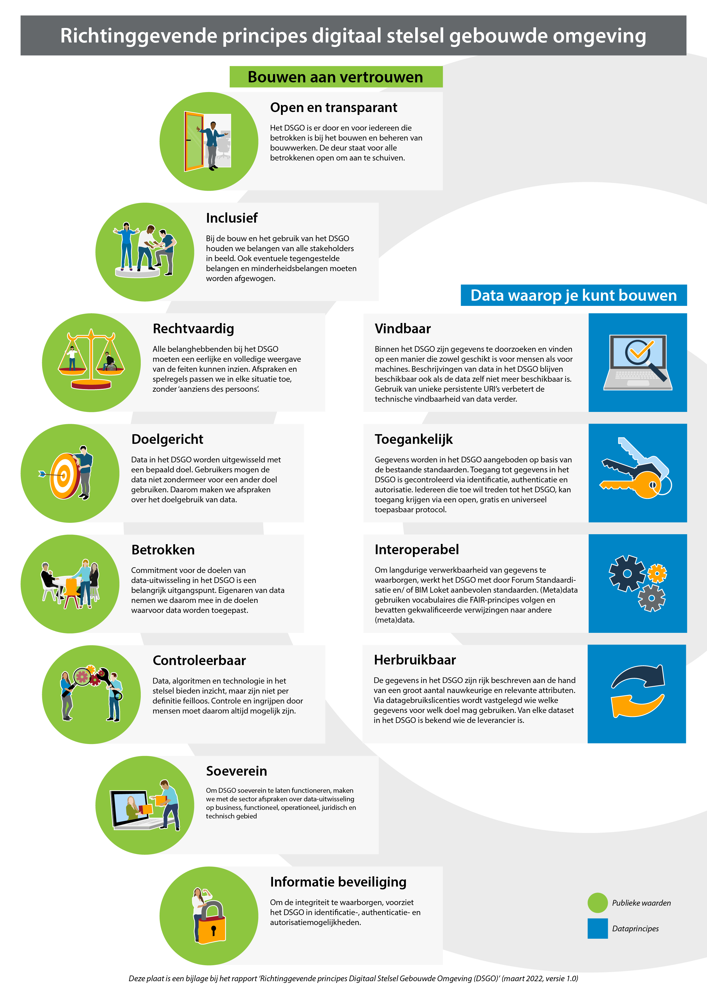

Managementsamenvatting
======================

Het Digitaal Stelsel Gebouwde Omgeving (DSGO) staat voor de uitdaging om te komen tot een set van
uniforme afspraken die zorgen voor *veilige, betrouwbare en gecontroleerde
toegang tot data in de bouwsector*. Voor het realiseren van de maatschappelijke
opgaven als energietransitie en woningbouw is het van essentieel belang om
toegang te hebben tot accurate gegevens over de gebouwde omgeving. ‘Data moet
stromen’ tussen de private en publieke partijen in de bouw- en
installatiesector, maar ook naar inwoners en woningeigenaren.

Het ministerie van Binnenlandse Zaken en Koninkrijksrelaties (BZK) is in diverse rollen betrokken bij de bouwsector en heeft als opdrachtgever en systeemverantwoordelijke er een groot belang bij dat de ontwikkeling van het DSGO op gang komt. Een aantal *richtinggevende principes* vanuit publiek belang helpt om vaart en richting te geven aan de [ontwikkeling van het DSGO](https://www.digigo.nu/nieuws/2157352.aspx) en is behulpzaam bij bijvoorbeeld doelarchitectuur of de  verdere uitwerking in een Project Start Architectuur (PSA) of Stelselarchitectuur (SA) van het programma. Aan Geonovum, BIM Loket en CROW is gevraagd dit rapport met  richtinggevende principes op te stellen en onder een aantal belangrijke stakeholders (ondermeer
MedMij, Rijksvastgoedbedrijf, Innopay, Aedes) informeel te consulteren.
Geonovum, BIM Loket en CROW hebben deze principes beschreven op basis van hun ervaringen
met de ontwikkeling en het beheer van afsprakenstelsels voor de vastlegging en
het delen van gegevens in de geo- én bouwsector.

Het resultaat is dit adviesrapport met richtinggevende principes. De principes zijn
onder te verdelen in principes geënt op de samenwerking van partijen in het
stelsel (publieke waarden, ) en het delen van gegevens (FAIR dataprincipes, ) over
de gebouwde omgeving.

Het uitgangspunt is om het DSGO te ontwerpen en gebruiken op basis van *publieke waarden*. Dit zijn waarden waarin gewenste ‘omgangsvormen’ zijn verweven.  In de voorgestelde ontwerpprincipes ligt de nadruk op het mogelijk maken van  een open en transparant ontwerpproces en het open en transparant delen van de uitkomsten.

Naast de principes die publieke waarden vertegenwoordigen, zijn er ook dataprincipes die een stelsel meer of minder toegankelijk kunnen maken.
De *dataprincipes* in dit rapport zijn beschreven aan de hand van de FAIR-kernbegrippen
vindbaar, toegankelijk, uitwisselbaar en herbruikbaar van gegevens.

Deze principes zijn vervolgens toegepast op drie *voorbeelden uit de praktijk*: de
Wet kwaliteitsborging voor het bouwen (), assetmanagement bij het Rijksvastgoedbedrijf () en het Landelijk Digitaal Platform Klimaatakkoord().
Deze voorbeelden hebben tot een aantal *extra handreikingen geleid, die gebaseerd zijn op de uitgewerkte principes*:
- Maak gebruik van open standaarden en overheidsdata (zoals de basisregistraties) die beschikbaar zijn. Begin niet zomaar met het ontwikkelen van een nieuwe standaard en sluit aan bij wat er al is.
- Maak zowel bottom-up als top-down afspraken die werken in de uitvoering en gelijk hun waarde bewijzen voor de gebruikers.
- Nieuwe data die ontstaat moet die ook beschikbaar gemaakt worden. Maak goede afspraken over het eigenaarschap en beheer van deze data. 

De *uitgangspunten, randvoorwaarden en eisen* zijn samengevat () als richtinggevende principes, die opdrachtgever het ministerie van BZK
‘onder de arm mee kan nemen’ bij de verdere uitwerking van het DSGO.

De in dit rapport voorgestelde principes voor samenwerking en het delen van data zijn richtinggevend voor de verdere ontwikkeling van het DSGO. Naar de mening van de schrijvers is er echter meer nodig om vaart te krijgen in de ontwikkeling van het DSGO. Wij bevelen het ministerie van BZK aan een aanjaagrol op zich te nemen om te komen tot een onderlinge samenwerking gebaseerd op vertrouwen. Een noodzakelijke taak in deze rol is het voeren van een strategische dialoog met de stakeholders verbonden aan de zes thema’s van het digiGo over nut en noodzaak van de principes en het data delen. Als duidelijk wordt wat men verwacht van elkaar en wat ieder heeft in te brengen, is samenwerking beter te organiseren. Tenslotte bevelen we aan om al bij de ontwikkeling van het DSGO aandacht te hebben voor onderhoud en beheer van de afspraken, inclusief de financiering ervan.

**Figuur: Bouwen aan vertrouwen, data waarop je kunt bouwen**

