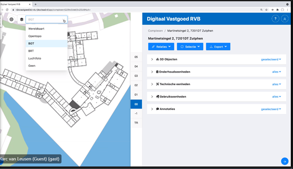

Van principes naar praktijk
===========================

Met onwerpprincipes op basis van publieke waarden en dataprincipes, geven we in dit hoofdstuk een drietal voorbeelden uit de praktijk:
-  Wet kwaliteitsborging voor het bouwen;
-  Assetmanagement;
- Landelijk Digitaal Platform

Wet kwaliteitsborging voor het bouwen
--------------------------------------
### Nieuwe wet- en regelgeving

De ‘preventieve toets’ door het bevoegd gezag voor het verlenen van een omgevingsvergunning voor het bouwen vervalt bij inwerkingtreden van de Wet kwaliteitsborging voor het bouwen (Wkb). De treedt naar verwachting vanaf 1 juli 2022 stapsgewijs inwerking. Dat hebben de minister van Binnenlandse Zaken en Koninkrijksrelaties en de Vereniging van Nederlandse Gemeenten aangegeven. De veranderingen uit de Wkb gelden (naar verwachting) tot en met 2024 alleen voor eenvoudige bouwwerken. Dit zijn bijvoorbeeld eengezinswoningen en kleinere bedrijfspanden. Vanaf 2025 volgen de andere bouwwerken. Hierdoor kunnen bouwbedrijven en gemeenten stap voor stap ervaring opdoen met het nieuwe toezicht in de bouw. 

Omgevingsvergunning wordt onder de Wkb verleend op basis van toetsing van een bouwplan (schetsontwerpniveau) aan het bestemmingsplan en plaatselijk geldende criteria (conform de Omgevingswet: het omgevingsplan). Aanvullend moet de aanvrager een risico-inventarisatie en een kwaliteitsborgingsplan overleggen aan het bevoegd gezag. 

De vergunningaanvrager/houder moet een gecertificeerde kwaliteitsborger inschakelen die gedurende het hele proces van ontwerp, uitvoering en oplevering controleert of het ontwerp en het uitvoeringsresultaat minimaal aan het Bouwbesluit (onder de Omgevingswet: Besluit bouwwerken leefomgeving) voldoet. Na oplevering van het bouwwerk geeft de kwaliteitsborger een verklaring af dat er een “gerechtvaardigd vertrouwen” is dat het gerealiseerde bouwwerk voldoet aan het Besluit bouwwerken leefomgeving. De vergunninghouder dient deze verklaring in bij het bevoegd gezag. 

Daarnaast dient de vergunninghouder een opleverdossier of “Digitaal Dossier Bevoegd Gezag” (DDBG) in bij het bevoegd gezag, c.q. de gemeente. Het dossier moet in principe het ‘bewijsmateriaal’ bevatten dat wordt voldaan aan het bouwbesluit. Vooralsnog is een uitgangspunt dat het DDBG bestaat uit een verzameling van pdf’s van tekeningen, berekeningen en documentatie; op termijn is de wens en de verwachting dat het DDBG de vorm krijgt van databestanden/computerinterpretabele informatiemodellen. 

De bouwer moet aan consument-opdrachtgevers een ‘Consumentendossier’ leveren. In opdracht van BZK heeft de NEN de norm [NPR 8092:2021 “Consumentendossier”](https://www.nen.nl/npr-8092-2021-nl-280630) ontwikkeld en gepubliceerd, waarin de vereiste inhoud van het dossier wordt beschreven. 

### Transparantie

Bij de introductie van de Wkb hebben alle betrokken partijen belang bij een transparante informatievoorziening en -uitwisseling. De opdrachtgever/vergunninghouder heeft groot belang bij een correct “Digitaal Dossier Bevoegd Gezag” waaruit blijkt dat aan de regelgeving wordt voldaan. Is dat dossier niet op orde, dan loopt de opdrachtgever/vergunninghouder het risico dat het bevoegd gezag de gebruiksvergunning weigert. Daarnaast wil de opdrachtgever/vergunninghouder bewijs (of een verantwoording) dat aan zijn eigen vraagspecificatie is voldaan.

De gecertificeerde kwaliteitscontroleur is afhankelijk van correcte en tijdige informatievoorziening over ontwerp en uitvoering. De vergunninghouder heeft hier een financieel belang bij: wanneer de informatie niet op orde is, noodzaakt dat de kwaliteitscontroleur tot een grotere inspanning om gefundeerde uitspraken te kunnen doen over de kwaliteit.  

Voor de bouwer is verificatie en validatie van ontwerp en uitvoering en beschikbaarheid van vrijgekomen informatie/data hierover van groot belang in verband met de verruimde aansprakelijkheid voor gebreken in het eindresultaat. Hij zal bij evntuele tekortkomingen willen bewijzen dat dat niet aan het ontwerp of de uitvoering heeft gelegen. (Dit is breder dan alleen het voldoen aan regelgeving, het gaat ook om het voldoen aan de vraagspecificatie van de opdrachtgever en het voorkomen van bouwfouten). 
Het bevoegd gezag is voor de uitoefening van zijn handhavingstaak afhankelijk van een correct Digitaal Dossier Bevoegd Gezag, dat – zeker in de toekomst - bij voorkeur op een standaard wijze is opgebouwd op basis van open standaarden. 
De consument-opdrachtgever is gebaat bij een goed toegankelijk, correct, compleet en gebruiksvriendelijke Consumentendossier, temeer daar de consument-opdrachtgever dit dossier na oplevering zelf up to date dient te houden.

Kortom: bij de introductie van de Wkb hebben alle betrokken partijen belang bij een transparante informatievoorziening en -uitwisseling. 

### Mee te geven aan ontwikkeling DSGO

Voor alle betrokken partijen is het– vanuit uiteenlopende belangen – essentieel dat projectinformatie vindbaar, toegankelijk, uitwisselbaar en herbruikbaar is. Het gaat in feite steeds om subsets van dezelfde data, die voor verschillende doeleinden en doelgroepen worden ingezet. Het is een gemeenschappelijk belang voor alle partijen om daar (in het kader van DSGO) gezamenlijk afspraken over te maken. Voor het bevoegd gezag is bovendien een uitgangspunt dat voor de samenstelling van het Digitaal Dossier Bevoegd Gezag gebruik moet worden gemaakt van systeemonafhankelijke, open standaarden. Ook voor ontwerpende en uitvoerende ketenpartners is systeemonafhankelijk uitwisseling van informatie van groot belang, opdat zij met hun eigen software kunnen blijven werken. 

Assetmanagement
----------------

### Inleiding

Het Rijks Vastgoed Bedrijf (RVB) is de vastgoedorganisatie van en voor de Rijksoverheid en is onderdeel van het ministerie van Binnenlandse Zaken en Koninkrijksrelaties. Het RVB is verantwoordelijk voor het beheer en de instandhouding van de grootste en meest diverse vastgoedportefeuille van Nederland.

Voor het beheer van deze vastgoedportefeuille maakt het RVB gebruik van vele dienstverleners, zowel dienstverleners van het Rijk, als ook externe dienstverleners. Om in al het vastgoed deze dienstverlening goed te laten verlopen is een transparante uitwisseling van data essentieel. Deze uitwisseling begint al bij de oplevering van een object na realisatie aan het RVB als assetbeheerder. In deze casusbeschrijving assetmanagement geven we een inkijkje in de manier waarop het RVB deze problematiek te lijf gaat, wat daarin tot nu toe al bereikt is en welke uitdagingen nog voor haar liggen.

### Aanvliegroute op basis van de registratie van het RVB 

Het Binnenhof wordt de komende jaren grondig verbouwd. In deze verbouwing wordt in de ontwerpfase netjes gewerkt met BIM, zodat de realisatie conform BIM wordt uitgevoerd. De overdracht naar de assetbeheerders ligt echter niet zo eenvoudig. De benodigde informatie voor assetmanagement blijkt heel anders te zijn, dan beschikbaar komt uit de realisatiefase. Vandaar dat het RVB gestart is met pilots waarin specifiek gekeken wordt naar de uitwisseling van informatie in de beheerfase.  In totaal zijn er 10 pilots gedaan met een basisadministratie, Digitaal Vastgoed RVB, en waarin 3D modellen van alle betreffende gebouwen beschikbaar zijn gemaakt. In onderstaande figuur staat een voorbeeld van de basisadministratie van de rechtbank in Zutphen. 

**Figuur: Voorbeeld uit de basisadministratie Digitaal Vastgoed RVB**

In een 3D model zijn alle verdiepingen van een object te selecteren, evenals alle ruimten of onderhoudseenheden en specifieke objecten binnen deze ruimten, zoals brandmelders of WiFi-apparatuur. Aan elk van deze ruimten zitten gegevens gekoppeld, te beginnen met een ruimtenummering. 

### Uitwisseling op basis van bij RVB bekende gegevens

Hoe kom je nu tot een goede uitwisseling tussen het facilitymanagementsysteem van de dienstverlener en dit Rijksvastgoedsysteem? Het RVB heeft de bij haar bekende gegevens van ruimten en objecten ter beschikbaar gesteld en daarmee een koppelvlak gedefinieerd. Met deze eerste stap, waarin zo min mogelijk afspraken zijn gemaakt en een eenvoudig en generieke koppelvlak is gegenereerd, kan iedere dienstverlener zijn eigen gegevens bekend toevoegen. Zo worden in eerste instantie handmatig de gegevens geüpload in het RVB-systeem.

Met VEOLIA heeft het RVB bijvoorbeeld een contract voor klimaattechniek en brandveiligheid. De gegevens worden echter beheerd door een onderaannemer en niet door  VEOLIA zelf. Vanuit het systeem van de onderaannemer worden nu de gegevens geëxporteerd naar het systeem van het RVB. Om deze gegevens aanlevering te bewerkstelligen is het van belang dat het RVB niet alleen de export/import mogelijkheden ter beschikking stelt. Het is ook van belang dat in de onderhoudscontracten de verplichting tot aanlevering van deze gegevens wordt opgenomen, ook als onderaannemers worden ingeschakeld. 

### Afspraken maken op basis van wederzijdse belangen

Zo zijn er zeker 10 pilots met vergelijkbare uitkomsten gerealiseerd. De vervolgstap is dat deze systematiek wordt doorgevoerd voor alle interne en externe dienstverleners die het RVB heeft gecontracteerd en dat er in- en export-systematiek wordt geautomatiseerd, zodat iedere wijziging in het facilitymanagementsysteem van de dienstverlening ook terecht komt in het systeem van het RVB.

Zo komt in beeld welke informatie er allemaal geregistreerd wordt voor het vastgoed van het RVB. Vanuit dit overzicht kunnen vervolgstappen worden genomen. Vanuit dit totaalbeeld kan het RVB haar informatiebehoefte bepalen voor de eigen bedrijfsvoering. Een slimmere en efficiënte bedrijfsvoering is het belang voor het RVB. De dienstverleners hebben eenzelfde belang: zo efficiënt mogelijke uitvoering van de opgedragen taken. Zo maakt het nogal uit voor VEOLIA als ze precies weet in welke ruimte de brandblusapparatuur staat. Als het overzicht van het RVB precies aangeeft waar ze te vinden zijn, dan is dat voor de keuring van brandblusapparaten wel zo efficiënt. Vanuit dit wederzijds belang is het zinvol om te investeren in duurzame uitwisseling van gegevens.

### Mee te geven aan ontwikkeling DSGO

**Maak bottom-up afspraken met alle betrokkenen**

De volgende stap van het RVB is het standaardiseren van de te registreren informatie, zodat bijvoorbeeld de keuringen van brandblusapparaten door alle dienstverleners op dezelfde manier worden geregistreerd. Zo ontstaat een uitwisselingsstandaard vanuit de praktijk, gebaseerd op wederzijdse belangen die open op tafel zijn gelegd. Deze praktijkbenadering vanuit een open gesprek over het wederzijdse belang werkt voor het RVB beter dan het ontwikkelen van een nieuwe informatiestandaard achter het bureau. Deze bottom-up ontwikkeling van afspraken, met betrokkenheid van alle betrokken partijen bij use cases die in het kader van het DSGO worden uitgewerkt.

**Sluit aan bij informatiemanagement conform de NEN-EN-ISO 19650-serie**

De [NEN-EN-ISO 19650-serie](https://www.bimloket.nl/p/269/NEN-EN-ISO-19650) (Organization and digitization of information about buildings and civil engineering works, including building information modelling – Information management using building information modelling) is dé internationale standaard voor informatiemanagement in de digitale levenscyclus van bouwwerken (assets). Eerder is in deze casusbeschrijving opgemerkt dat de benodigde informatie voor assetmanagement heel anders blijkt te zijn dan doorgaans beschikbaar komt uit de realisatiefase. Om deze reden stelt de NEN-EN-ISO 19650 dat de opdrachtgever bij het sluiten van een contract voor nieuw of aan te passen vastgoed vooraf de inhoud en vorm van de informatie dient te specificeren die de opdrachtnemer dient te leveren ten behoeve van het assetmanagement. Deze “Informatie Leverings Specificatie” (ILS) is onderdeel van het contract. 

Met zijn pilots en de vervolgstappen daarop vergaart het RVB, samen met de dienstverleners, gaandeweg de kennis die nodig is voor het opstellen van goede ILS’en voor toekomstige nieuwbouw-, renovatie-, verbouwings- en onderhoudscontracten. Het RVB deelt deze kennis met andere (semi-)overheidsopdrachtgevers in de Werkgroep BIM Opdrachtgevers B&U van het Opdrachtgeversforum. Einddoel is de ontwikkeling van een gezamenlijke, standaard ILS-systematiek, waardoor opdrachtnemers niet voor iedere opdrachtgever met een andere informatievraag worden geconfronteerd. Het BIM Loket faciliteert dit proces.  

Op vergelijkbare wijze zijn veel organisaties en bedrijven in de sectoren bouw en infra bezig de NEN-EN-ISO 19650 normen te implementeren in hun werkwijzen. Voor het maken van afspraken in het kader van het DSGO is het zaak zo goed mogelijk aan te sluiten op deze normenserie, zodat ontwikkelingen elkaar kunnen versterken en tevens aansluiting op internationale ontwikkelingen wordt gerealiseerd.

Landelijk Digitaal Platform
---------------------------

### Aanleiding

In het Klimaatakkoord is afgesproken dat er een landelijk digitaal platform
wordt gelanceerd voor woningeigenaren voor verduurzaming van hun woning. Inzet
is dat woningeigenaren hun klantreis voor een groot deel met het digitaal
platform kunnen afleggen.

Het landelijk digitaal platform is gerealiseerd in het online platform
[‘verbeterjehuis.nl’](https://www.verbeterjehuis.nl/). Een eerdere versie van het platform integreert
energiebespaarinitiatieven als energiebesparendoejenu.nl,
energiesubsidiewijzer.nl en ontsluiting van de Energiebesparingsverkenner van de
Rijksdienst voor Ondernemend Nederland.

### Samenwerking

Vanaf augustus 2021 werken Woonconnect en Greenhome in samenwerking met Milieu
Centraal en in opdracht van ministerie van BZK aan de doorontwikkeling van het
platform. Woonconnect en Greenhome zijn geselecteerd met een openbare Europese
aanbestedingsprocedure.

Woningeigenaren kunnen gevalideerde energie-bespaarmaatregelen en
financieringsmogelijkheden op zoeken op basis van woningkenmerkeno opvragen.
Uitvoerders in de bouw- en installatiesector kunnen hun diensten en producten
aanbieden op het platform. Zo komt vraag en aanbod bij elkaar op dit platform.

### Data 

In het platform worden de gegevens van de [Basisregistratie Adressen en Gebouwen](https://www.geobasisregistraties.nl/basisregistraties/adressen-en-gebouwen)
als basis gebruikt, denk aan gebruiksoppervlakte, bouwjaar. Op basis van daarvan
wordt een eerste profiel van de woning samengesteld.

Woningeigenaren krijgen verder een aantal aanvullende vragen om hun woning
verder te configureren: heeft de woning vloer/gevel, welke verwarmingstype etc.
Deze aanvullende gegevens zijn niet landelijk in overheidsdata beschikbaar.

Met de nog-te-ontwikkelen-functionaliteit van Woonconnect wordt het zelfs
mogelijk om met een paar simpele vragen een zeer goede benadering van een 3D
model te maken van het huis, waarbij ramen en deuren op de goede plek zitten.

Er wordt onderzocht of ook gegevens van het energielabel en
energieverbruiksgegevens aan het landelijk digitaal platform. Zo kan een nog
beter advies voor besparingsmaatregelen worden opgesteld.

Wetgeving werkt hierin belemmerend: zowel energielabel als
energieverbruiksgegevens zijn aangeduid als persoongegevens en kunnen daarmee
alleen na toestemming van woningeigenaar aan het platform beschikbaar worden
gesteld. (machtiging)

**Figuur: Verbeterjehuis.nl voorbeeld van een landelijk digitaal platform**

### Mee te geven aan ontwikkeling DSGO

Op basis van het gesprek over ervaringen bij de ontwikkeling van het Landelijk
Digitaal Platform kunnen de volgende aandachtspunten, eisen, best practices,
ofwel aanbevelingen worden meegegeven aan de ontwikkeling van het DSGO:

**Maak goede afspraken over wie eigenaar wordt van in het platform/stelsel
gegenereerde data.**

In het Landelijk Digitaal Platform ontstaan extra gegevens over de betreffende woning door invoer van
woningeigenaar middels de configuratietools.

Belangrijk is om goede afspraken te maken over:

-   Waar de data wordt opgeslagen, en hoe deze wordt teruggeleverd. Wordt de
    data opgeslagen bij de marktpartij die de ICT van het platform/stelsel
    ontwikkeld eo beheerd opgeslagen, of bij een (semi-)overheidspartij à la RVO
    of Kadaster. Wordt de data per object/adres of geaggregeerd teruggeleverd
    aan opdrachtgever?

-   Wie eigenaar wordt van de nieuw gegeneerde gegevens? Is dat de
    woningeigenaar, marktpartij die het systeem voor het platform/stelsel
    ontwikkeld en/ of beheerd, of is dat opdrachtgever BZK?

N.B. Niet onbelangrijk is om ook afspraken te maken over de broncode van het
systeem/platform zelf. Het zal niet de eerste keer zijn dat de integratie van de
functionaliteit van een systeem in een ander systeem niet 1:1 uitgevoerd kan
worden, omdat er geen afspraken zijn gemaakt over wie eigenaar is van de
broncode.

**Maak afspraken voor welke toepassingen hergebruik van in het platform/stelsel
gegenereerde data toegestaan is.**

De data in het Landelijk Digitaal Platform worden verzameld om energiebesparende maatregelen te
berekenen en te kunnen realiseren. Er ontstaan veel gegevens die ook interessant
kunnen zijn voor andere toepassingen. Niet zonder meer mogen deze gegevens dan
ook voor deze toepassing worden gebruikt. Het uitgangspunt van doelbinding is,
dat gegevens worden verwerkt en verzameld voor een welbepaald, uitdrukkelijk
omschreven en gerechtvaardigde doel.

Door uitdrukkelijk te beschreven waar de gegevens voor worden verzameld en
gebruikt, ontstaat niet alleen vertrouwen tussen partijen dat gegevens niet op
een andere manier worden (her)gebruikt, maar zorgt ook dat overheden elkaar geen
boetes op gaan leggen als later blijkt dat wet- en regelgeving (privacy) is
geschonden. Regie op gegevens en doelbinding zijn dus cruciaal voor vertrouwen
van tussen woningeigenaar en overheid, en overheden onderling.

**Stel best practices op voor de toepassing van wetgeving op een data
platform.**

Wetgeving (AVG) blijkt belemmerend bij het realiseren van een stelsel/platform
waarin ook persoonsgegevens worden toegepast.

Er bestaat soms onduidelijkheid, en als gevolg daarvan zijn overheden
terughoudend om een volgende stap te durven zetten. Te meer omdat er forse
boetes staan op het schenden van deze wet- en regelgeving.

Het is dus nodig om te zorgen voor meer duidelijkheid in wat wel en niet
    mag. Aanbeveling is om een aantal (overheidsbrede) best practices inzake
    wet- en regelgeving gerelateerd aan ondermeer AVG als leidraad te verzamelen of
    op te stellen voor de ontwikkeling van data platforms of digitale stelsel.
    Het scheelt veel uitzoekwerk, geeft houvast, en kan daarmee de ontwikkeling
    van dergelijke platforms en stelsels versnellen.

>   **Voorbeeld:** [Is een adres nu een persoonsgegeven of een objectgegeven?](https://ibestuur.nl/podium/avg-hoeft-open-bag-data-niet-in-de-weg-te-staan) Lees
>   het artikel van experts op gebied van privacy en open (geo)data, Bastiaan
>   van Loenen en Marc de Vries.

**Zorg voor een overheidsbrede toolbox met standaard componenten.**

We bedoelen hiermee dat een aantal basistools voor bijvoorbeeld authenticatie,
autorisatie en machtigingen beschikbaar en bekend zijn. Voor het Landelijk Digitaal PLatform is [iShare](https://www.ishareworks.org/ishare)
als machtigingenmodule gekozen; voor een andere platform wordt
[iDIN](https://www.idin.nl/over-idin/scheme/) als machtigingenmodule gekozen.
Per project wordt nu eigen keuzes gemaakt, wat tijd, geld, doorlooptijd kost,
maar ook ten koste gaat van standaardisatie en interoperabiliteit.

Het kan de ontwikkeling van een platform of stelsel versnellen als er een
toolbox beschikbaar is, met een keuzewijzer welke tool voor welke toepassing het
meest geschikt is. Dit kan de ontwikkeling van een stelsel/platform versnellen,
en standaardisatie maakt eenvoudigere integratie met andere platforms/tools op
later moment mogelijk.

>   **Voorbeeld:** Pas-toe-of-leg-uit-lijst van Forum Standaardisatie of de
>   keuzehulp Lichte formaten van Geonovum.
