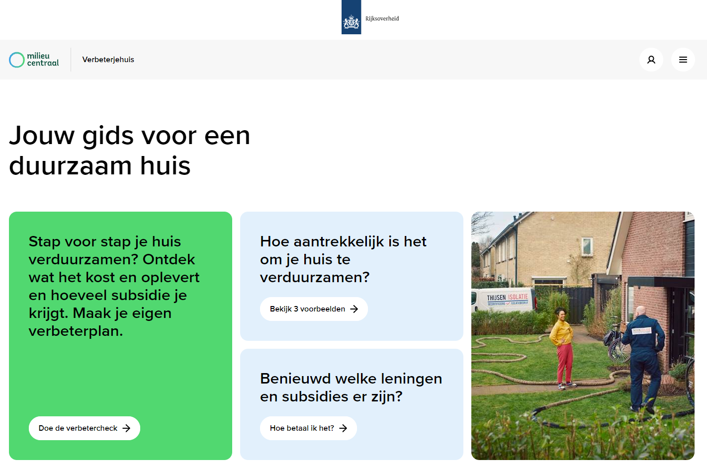

Van principes naar praktijk
===========================

Dit hoofdstuk beschrijft de toepassing van de principes voor publieke waarden en
data op de praktijk.

Wet kwaliteitsborging voor het bouwen (Wkb)
-------------------------------------------

Asset management
----------------

Landelijk Digitaal Platform
---------------------------

### Aanleiding

In het Klimaatakkoord is afgesproken dat er een landelijk digitaal platform
wordt gelanceerd voor woningeigenaren voor verduurzaming van hun woning. Inzet
is dat woningeigenaren hun klantreis voor een groot deel met het digitaal
platform kunnen afleggen.

Het landelijk digitaal platform is gerealiseerd in het online platform
[‘verbeterjehuis.nl’](https://www.verbeterjehuis.nl/). Een eerdere versie van het platform integreert
energiebespaarinitiatieven als energiebesparendoejenu.nl,
energiesubsidiewijzer.nl en ontsluiting van de Energiebesparingsverkenner van de
Rijksdienst voor Ondernemend Nederland.

### Samenwerking

Vanaf augustus 2021 werken Woonconnect en Greenhome in samenwerking met Milieu
Centraal en in opdracht van ministerie van BZK aan de doorontwikkeling van het
platform. Woonconnect en Greenhome zijn geselecteerd met een openbare Europese
aanbestedingsprocedure.

Woningeigenaren kunnen gevalideerde energie-bespaarmaatregelen en
financieringsmogelijkheden op zoeken op basis van woningkenmerkeno opvragen.
Uitvoerders in de bouw- en installatiesector kunnen hun diensten en producten
aanbieden op het platform. Zo komt vraag en aanbod bij elkaar op dit platform.

### Data 

In het platform worden de gegevens van de [Basisregistratie Adressen en Gebouwen](https://www.geobasisregistraties.nl/basisregistraties/adressen-en-gebouwen)
als basis gebruikt, denk aan gebruiksoppervlakte, bouwjaar. Op basis van daarvan
wordt een eerste profiel van de woning samengesteld.

Woningeigenaren krijgen verder een aantal aanvullende vragen om hun woning
verder te configureren: heeft de woning vloer/gevel, welke verwarmingstype etc.
Deze aanvullende gegevens zijn niet landelijk in overheidsdata beschikbaar.

Met de nog-te-ontwikkelen-functionaliteit van Woonconnect wordt het zelfs
mogelijk om met een paar simpele vragen een zeer goede benadering van een 3D
model te maken van het huis, waarbij ramen en deuren op de goede plek zitten.

Er wordt onderzocht of ook gegevens van het energielabel en
energieverbruiksgegevens aan het landelijk digitaal platform. Zo kan een nog
beter advies voor besparingsmaatregelen worden opgesteld.

Wetgeving werkt hierin belemmerend: zowel energielabel als
energieverbruiksgegevens zijn aangeduid als persoongegevens en kunnen daarmee
alleen na toestemming van woningeigenaar aan het platform beschikbaar worden
gesteld. (machtiging)

**Figuur: Verbeterjehuis.nl voorbeeld van een landelijk digitaal platform**

### Mee te geven aan ontwikkeling DSGO

Op basis van het gesprek over ervaringen bij de ontwikkeling van het Landelijk
Digitaal Platform kunnen de volgende aandachtspunten, eisen, best practices,
ofwel aanbevelingen worden meegegeven aan de ontwikkeling van het DSGO:

**Maak goede afspraken over wie eigenaar wordt van in het platform/stelsel
gegenereerde data.**

In het Landelijk Digitaal Platform ontstaan extra gegevens over de betreffende woning door invoer van
woningeigenaar middels de configuratietools.

Belangrijk is om goede afspraken te maken over:

-   Waar de data wordt opgeslagen, en hoe deze wordt teruggeleverd. Wordt de
    data opgeslagen bij de marktpartij die de ICT van het platform/stelsel
    ontwikkeld eo beheerd opgeslagen, of bij een (semi-)overheidspartij à la RVO
    of Kadaster. Wordt de data per object/adres of geaggregeerd teruggeleverd
    aan opdrachtgever?

-   Wie eigenaar wordt van de nieuw gegeneerde gegevens? Is dat de
    woningeigenaar, marktpartij die het systeem voor het platform/stelsel
    ontwikkeld en/ of beheerd, of is dat opdrachtgever BZK?

N.B. Niet onbelangrijk is om ook afspraken te maken over de broncode van het
systeem/platform zelf. Het zal niet de eerste keer zijn dat de integratie van de
functionaliteit van een systeem in een ander systeem niet 1:1 uitgevoerd kan
worden, omdat er geen afspraken zijn gemaakt over wie eigenaar is van de
broncode.

**Maak afspraken voor welke toepassingen hergebruik van in het platform/stelsel
gegenereerde data toegestaan is.**

De data in het Landelijk Digitaal Platform worden verzameld om energiebesparende maatregelen te
berekenen en te kunnen realiseren. Er ontstaan veel gegevens die ook interessant
kunnen zijn voor andere toepassingen. Niet zonder meer mogen deze gegevens dan
ook voor deze toepassing worden gebruikt. Het uitgangspunt van doelbinding is,
dat gegevens worden verwerkt en verzameld voor een welbepaald, uitdrukkelijk
omschreven en gerechtvaardigde doel.

Door uitdrukkelijk te beschreven waar de gegevens voor worden verzameld en
gebruikt, ontstaat niet alleen vertrouwen tussen partijen dat gegevens niet op
een andere manier worden (her)gebruikt, maar zorgt ook dat overheden elkaar geen
boetes op gaan leggen als later blijkt dat wet- en regelgeving (privacy) is
geschonden. Regie op gegevens en doelbinding zijn dus cruciaal voor vertrouwen
van tussen woningeigenaar en overheid, en overheden onderling.

**Stel best practices op voor de toepassing van wetgeving op een data
platform.**

Wetgeving (AVG) blijkt belemmerend bij het realiseren van een stelsel/platform
waarin ook persoonsgegevens worden toegepast.

Er bestaat soms onduidelijkheid, en als gevolg daarvan zijn overheden
terughoudend om een volgende stap te durven zetten. Te meer omdat er forse
boetes staan op het schenden van deze wet- en regelgeving.

Het is dus nodig om te zorgen voor meer duidelijkheid in wat wel en niet
    mag. Aanbeveling is om een aantal (overheidsbrede) best practices inzake
    wet- en regelgeving gerelateerd aan ondermeer AVG als leidraad te verzamelen of
    op te stellen voor de ontwikkeling van data platforms of digitale stelsel.
    Het scheelt veel uitzoekwerk, geeft houvast, en kan daarmee de ontwikkeling
    van dergelijke platforms en stelsels versnellen.

>   **Voorbeeld:** Is een adres nu een persoonsgegeven of een objectgegeven? Lees
>   het artikel van experts op gebied van privacy en open (geo)data, Bastiaan
>   van Loenen en Marc de Vries:*
>   <https://ibestuur.nl/podium/avg-hoeft-open-bag-data-niet-in-de-weg-te-staan>

**Zorg voor een overheidsbrede toolbox met standaard componenten.**

We bedoelen hiermee dat een aantal basistools voor bijvoorbeeld authenticatie,
autorisatie en machtigingen beschikbaar en bekend zijn. Voor het LDP is iShare
als machtigingenmodule gekozen; voor een andere platform (welke?) wordt
[iDIN](https://www.idin.nl/over-idin/scheme/) als machtigingenmodule gekozen.
Per project wordt nu eigen keuzes gemaakt, wat tijd, geld, doorlooptijd kost,
maar ook ten koste gaat van standaardisatie en interoperabiliteit.

Het kan de ontwikkeling van een platform of stelsel versnellen als er een
toolbox beschikbaar is, met een keuzewijzer welke tool voor welke toepassing het
meest geschikt is. Dit kan de ontwikkeling van een stelsel/platform versnellen,
en standaardisatie maakt eenvoudigere integratie met andere platforms/tools op
later moment mogelijk.

>   *Voorbeeld: Pas-toe-of-leg-uit-lijst van Forum Standaardisatie of de
>   keuzewijzer Lichte formaten van Geonovum.*
