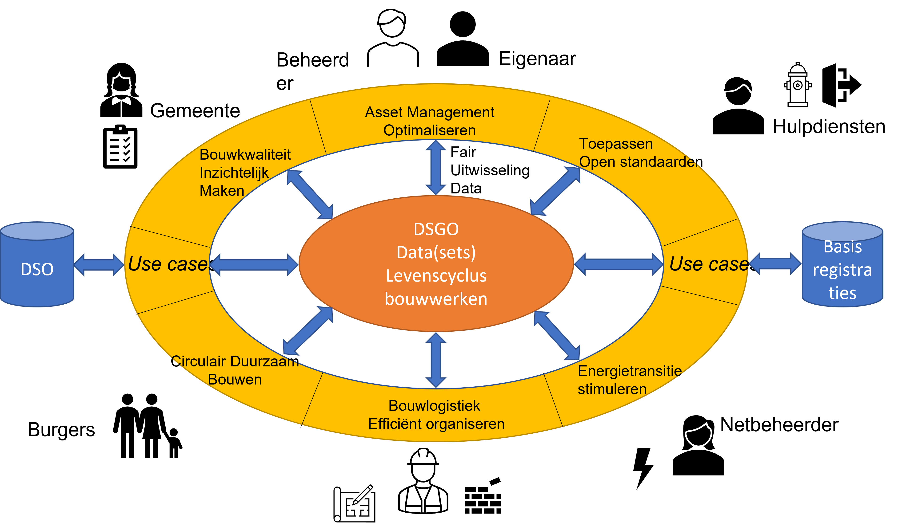

Publieke waarden
================

Het DSGO dient het publiek belang door data uit de gebouwde omgeving beschikbaar
te stellen voor alle belanghebbenden bij de data. Om het publieke belang te
waarborgen worden 8 ontwerpprincipes gehanteerd voor het ontwerpproces van het
DSGO. Niet de publieke waarden zelf, maar de ontwerpprincipes voor het DSGO op basis van de publiek waarden staan centraal. 
Deze 8 ontwerpprincipes zijn in dit hoofdstuk vertaald in uitgangspunten,
randvoorwaarden en eisen. Ze geven richting aan het proces om te komen tot
sectorbrede afspraken over uitwisseling, eigenaarschap en organisatie van data.

Het DSGO ontwerpen op basis van publieke waarden die de samenleving reflecteren
-------------------------------------------------------------------------------

Doel van het DSGO is om te komen tot een set van uniforme afspraken die
zorgt voor veilige, betrouwbare en gecontroleerde toegang tot data in de
bouwsector. Door deze uniforme afspraken kunnen partijen makkelijk en veilig
gebruik maken van reeds beschikbare data: in alle fases van de levenscyclus van
een bouwwerk.

Het DSGO gaat over de totale gebouwde omgeving en dient daarmee de samenleving
in heel veel processen. Voorbeelden daarvan zien we terug in de behoeftes van
publieke en private organisaties naar data uitwisseling die zijn samengevat in
34 use cases, gegroepeerd in zes thema’s. Het DSGO regisseert samenhang door te
komen tot een set van afspraken over het uitwisselen van data tussen
organisaties. Het DSGO helpt digitalisering in de bouw- en installatie sector,
en draagt daarmee bij aan diverse maatschappelijke opgaven.

Veel partijen uit de samenleving dragen bij om tot het gewenste resultaat te
komen en wisselen daartoe data uit met elkaar. Datasets over een gebouw dienen een groot aantal partijen uit de samenleving. Daarmee dient deze data zowel een privé belang (bijvoorbeeld de data over het energiegebruik binnen een gebouw) alsook een publiek belang (bijvoorbeeld het
voldoen aan de brandveiligheidsvoorschriften of de voorschriften uit de bouwvergunning). Het is daarom van belang dat het DSGO de publieke waarden van de samenleving reflecteert, en dat alle betrokkenen zich kunnen vinden in de afspraken. Het effect van deze benadering zou kunnen zijn dat de  adoptie van het DSGO versneld wordt.

De gemaakte afspraken borgen als het goed is de belangen van elke betrokken
partij en worden vervolgens omgezet in technologie die de uitwisseling van data
werkend maakt. Vaak is deze technologie een ijsberg, waar we alleen het topje
van zien, het zogenaamde burgerperspectief. WAAG laat dit zien in hun visie op
technologie uitgewerkt in hun [digitale routekaart](https://waag.org/sites/waag/files/2020-05/routekaart-digitale-toekomst-v0.3.pdf). Wat onder water is, zien we
niet. Maar uiteindelijk is alle technologie gemaakt door mensen. Zij zijn het
die deze ontwerpen, ontwikkelen, uitrollen en stap voor stap onze maatschappij
veranderen. Technologie is niet neutraal, maar het product van talloze
beslissingen, die gebaseerd zijn op de waarden die de ontwerper hanteert. Daar
ligt ook de sleutel tot het verkrijgen van meer grip op deze ontwikkelingen: we
moeten niet alleen kijken naar het topje, maar met elkaar de hele ijsberg zien
en ontwerpen. Voor het DSGO doen we dat dus op basis van publieke waarden, die we
concreet hebben gemaakt in de hierna uitgewerkte 8 ontwerpprincipes.

Beleidscontext publieke waarden
---------------------------------

In 2017 heeft het Rathenau instituut met haar onderzoek ['Opwaarderen - Borgen van publieke waarden in de digitale samenleving'](https://www.rathenau.nl/sites/default/files/2018-02/Opwaarderen_FINAL.pdf) aandacht gevraagd voor dit onderwerp en gepleit voor een actieprogramma. Sinds dat moment heeft het ministerie van BZK deze handschoen opgepakt, als hoeder van de Nederlandse Grondwet en grondrechten. Er zijn diverse actielijnen uitgezet vanuit de [Agenda Digitale Overheid](https://www.digitaleoverheid.nl/overzicht-van-alle-onderwerpen/nldigibeter/beschermen-van-grondrechten-en-publieke-waarden/). Daarin wordt ook aangegeven wat tot nu toe bereikt is. Vanaf 2019 is de voorlichting gestart over dit onderwerp. Tevens is er onderzoek verricht naar de effecten van digitalisering op de maatschappij.

Deze aandacht heeft er onder andere toe geleid dat er ook concrete handvatten zijn ontwikkeld:
-	De [Interbestuurlijke Datastrategie Nederland](https://www.rijksoverheid.nl/documenten/rapporten/2021/10/31/nl-digitaal-interbestuurlijke-datastrategie-nederland) schetst op hoofdlijnen hoe de overheid kansen om maatschappelijke opgaven met data op een effectieve manier aan te gaan vaker en beter kan realiseren, waarbij risico's van datagebruik goed worden afgewogen. Daarnaast bevat de datastrategie eerste suggesties voor verdere uitwerking van systeemfuncties (oktober 2021);
-	Er is een code ontwikkeld door de Universiteit Utrecht voor voor [goed digitaal openbaar bestuur](https://www.rijksoverheid.nl/documenten/rapporten/2021/04/30/code-goed-digitaal-openbaar-bestuur) (april 2021);
-	Naast de Rijksoverheid heeft ook de VNG met de gemeenten nagedacht over [principes voor de digitale samenleving](https://vng.nl/sites/default/files/2019-11/09a-bijlage-principes-voor-de-digitale-samenleving.pdf) (november 2019);
-	Het [Beleidskader Digitale basisinfrastructuur](https://www.noraonline.nl/images/noraonline/2/25/Beleidskader_digitale_basisinfrastructuur.pdf) bevat de uitgangspunten voor de digitale basisinfrastructuur, die dienstverleners met een publieke taak gebruiken voor de inrichting van de publieke dienstverlening aan burgers en bedrijven en waar nodig ook voor hun onderlinge digitale samenwerking (april 2019);
-	Het [toekomstbeeld van het Stelsel van Basisregistraties] (https://www.noraonline.nl/wiki/Bestand:Toekomstbeeld_Stelsel_van_Basisregistraties.pdf) schetst een strategisch kader voor de doorontwikkeling van het huidige stelsel van basisregistraties met 10 basisregistraties naar een federatief datastelsel met een veelvoud aan hoogwaardige datasets (januari 2022);
-	[Agenda Digitale Grondrechten en Ethiek 2022-2026](https://vng.nl/nieuws/agenda-digitale-grondrechten-en-ethiek-2022-2026-uit) leggen gemeenten gezamenlijk ambities vast over het beschermen van grondrechten en het borgen van publieke waarden in de informatiesamenleving;
-	Vanuit het [locatiepact](https://www.wijsmetlocatie.nl/) waarin een groep overheden, bedrijven en kennisinstellingen met elkaar samenwerken aan locatietechnologie, is een [ethische referentie](https://www.wijsmetlocatie.nl/wat-we-doen/ethiek) ontwikkeld. Deze is in de praktijk getoetst en vergeleken met diverse andere ethische referenties;
-	[Draft-Principes voor Crowd-monitoring](https://vng.nl/nieuws/agenda-digitale-grondrechten-en-ethiek-2022-2026-uit) als uitwerking van principes voor de ethische inzet van nieuwe technologie voor crowd-management (2021);
-	Er zijn diverse beleidsinstrumenten gerealiseerd zoals een toolbox om gemeenten te helpen verantwoord te innoveren, zoals de [praktijkrichtlijn open urban platforms](https://www.nen.nl/nieuws/smartcities/nederlandse-praktijkrichtlijn-open-urban-platforms-beschikbaar/) (januari 2020);
-	Er is een handreiking ontwikkeld voor [non-discriminatie bij de toepassing van AI](https://www.rijksoverheid.nl/documenten/rapporten/2021/06/10/handreiking-non-discriminatie-by-design) (juni 2021).

Ook Vanuit **Europa** is er een sterk sturende rol van de commissie op het handhaven van publieke waarden zoals blijkt uit de [Europese digitale strategie](https://ec.europa.eu/info/strategy/priorities-2019-2024/europe-fit-digital-age/shaping-europe-digital-future_nl). Bouwstenen in de Europese digitale strategie zijn:
- De [Verordening Digitale Markten (Digital Markets Act, DMA)](https://www.tweedekamer.nl/kamerstukken/detail?id=2021Z03095&did=2021D06764), die de digitale eenheidsmarkt reguleert, en een reeks eisen stelt ten aanzien van interoperabiliteit, eerlijkheid en openheid, en de markpositie reguleert van grote online platformen die als gatekeepers functioneren. De DMA is als voorstel gepubliceerd eind 2020, met een [beoogde implementatie](https://ec.europa.eu/info/strategy/priorities-2019-2024/europe-fit-digital-age/digital-markets-act-ensuring-fair-and-open-digital-markets_nl) uiterlijk begin 2022.
- De [Verordening Digitale Diensten (Digital Services Act, DSA)](https://www.rijksoverheid.nl/actueel/nieuws/2021/11/24/eu-ministers-akkoord-met-regelgeving-digitale-diensten-en--markten), die de digitale eenheidsmarkt als gelijk speelveld inricht voor innovatie, groei, en concurrentie, en waar de grondrechten van alle gebruikers van digitale diensten actief gewaarborgd zijn, onder meer door vereisten ten aanzien van transparantie en een verantwoordingsraamwerk voor dienstverleners. De DSA is als voorstel gepubliceerd eind 2020, met een [beoogde implementatie](https://europadecentraal.nl/europees-parlement-stemt-in-met-de-digital-services-act/) uiterlijk begin 2022.

Ontwerpprincipes DSGO
---------------------

### Open en transparant

**Open en transparant ontwerp proces**

Het DSGO ontwerpen we op basis van publieke waarden. Het ontwerpproces van het DSGO richt zich voornamelijk op het uitwerken van generieke afspraken die in de verschillende 34 benoemde use cases (zie figuur DSGO use cases, hieronder) toepasbaar zijn. Deze afspraken kunnen vervolgens door de stakeholders van de verschillende use cases worden gebruikt om het uitvoeren van de specifieke use case te faciliteren. Gedurende het co-creatieproces voor het uitwerken van de afspraken wordt een representatie van deze stakeholders intensief betrokken. Het DSGO ondersteunt daarmee diverse publieke belangen van verschillende actoren. 
Het ontwerpproces van het DSGO is daarin bepalend. Centraal in dat proces staan het ‘burgerperspectief’ en participatie van betrokkenen uit de bouwsector. Deze participatie goed vormgeven en begeleiden is fundamenteel randvoorwaardelijk en tegelijkertijd de grootste uitdaging bij de ontwikkeling van het DSGO.

**Figuur: De DSGO use cases**

De ontwerpprincipes zijn daarom bedoeld als principes om mee te werken, die de participanten
tijdens het ontwerpproces doordenken en doorleven, zodat de juiste keuzes
gemaakt worden. In het vervolg illustreren wij deze ontwerpprincipes op basis
van de genoemde use cases.

>   **Randvoorwaarde:** Alle betrokkenen bij een use case bespreken de
>   ontwerpprincipes, om concreet te maken wat deze voor een use case betekenen. De
>   keuzes die hieruit volgen worden vastgesteld en ingericht, bijgesteld en zo
>   lerend ontwikkeld, zodat anderen daarop kunnen voortbouwen.

**Open en transparante uitkomsten**

Data, algoritmen en technologie zijn navolgbaar, herleidbaar en begrijpelijk.
Binnen de use cases worden data en datasets gevormd, gebruikt, bewerkt,
doorgegeven. [Data(sets)](#data-datasets-en-metadata) die uitgewisseld worden, daarvan is duidelijk hoe deze
in de opeenvolgende processtappen zijn ontstaan zodat de oorsprong herleidbaar
is.

Dit principe is van belang om alle partijen in de keten te informeren over de
herkomst en dus de kwaliteit van de data. Voor het achterhalen van de
bouwkwaliteit is het bijvoorbeeld voor de gemeente van belang dat alle
kwaliteitscontroles goed zijn uitgevoerd. Mocht er ergens een probleem mee zijn,
dan kan altijd teruggezocht worden naar de oorsprong van de kwaliteitscontrole
en de onderliggende data.

>   **Eis:** Use cases leggen voor elke data(set) die tussen partijen uitgewisseld wordt,
>   vast wat de oorsprong van deze dataset is en welke bewerkingen deze heeft
>   ondergaan.

### Inclusiviteit

Er wordt zorgvuldig omgegaan met de belangen van alle
belanghebbenden. Dit houdt in dat de data waarover afspraken gemaakt wordt, de werkelijkheid weerspiegelen. Afspraken die gemaakt worden gaan soms over een kleine groep die niet aan tafel zit. Voorkomen moet worden dat groepen worden buitengesloten of dat data verkeerd wordt geïnterpreteerd of dat verkeerde berekeningen worden toegepast. Een onafhankelijke voorzitter is daarin een eis. Die zorgt ervoor dat in het
proces van belangenafweging eventuele tegengestelde belangen en
minderheidsbelangen meegenomen worden. Voor elke use case wordt bijvoorbeeld
nagegaan of alle doelgroepen aan boord zijn of vertegenwoordigd zijn, voor het
uitwerken van de use case, met bijzondere aandacht voor de positie van burgers.

In het kader van circulariteit en bouwkwaliteit is het bijvoorbeeld van belang
burgers te betrekken. Zolang hun woning geen mankementen vertoont is er niets aan de
hand. Op het moment dat er duidelijk problemen blijken te zijn met bepaalde
materialen of producten, zoals problemen met het beton (betonrot, constructiefouten in overhangende balkons), dan willen burgers graag weten of procesfouten of gebrekkige producten in hun woning verwerkt zijn. Zij behoren hierover actief geinformeerd te worden.

>   **Randvoorwaarde:** Maak de ontwikkeling van het DSGO inclusief, zodat er geen groepen worden 
>   buitengesloten door de manier waar op de afspraken gemaakt worden over het delen van data. De belangen
>   van alle stakeholders zijn in beeld bij elke use case. Het goed beleggen van  mandaat en eigenaarschap alsook 
>   een onafhankelijk voorzitter zijn aan te raden middelen voor een transparante governance.

>   **Eis:** Om te voorkomen dat  groepen worden buitengesloten of dat data verkeerd wordt geïnterpreteerd of dat verkeerde berekeningen worden toegepast,
>   is een onafhankelijke voorzitter vereist.

### Rechtvaardigheid

Alle belanghebbenden verlangen een eerlijke en gelijkwaardige behandeling. Dat
houdt in dat de gemaakte afspraken en spelregels eerlijk worden toegepast in
elke situatie zonder ‘aanziens des persoons’. In de context van het DSGO is
daarbij een eerlijke en volledige weergave van feiten gebaseerd op data
essentieel. Op basis van data worden immers besluiten genomen zoals het
toekennen van een vergunning.

In het kader van bouwkwaliteit is het van belang dat kwaliteitsinformatie
over het bouwwerk bekend is en voor iedereen toegankelijk, accuraat, betrouwbaar en volledig wordt weergegeven, zodat de oplevering van het
bouwwerk goedgekeurd kan worden door de gemeente. Dit is van belang zowel voor
de gemeente als voor de toekomstig eigenaar en beheerder.

>   **Eis:** Ontwerp elke use case binnen het DSGO rechtvaardig, zodat alle
>   belanghebbenden een eerlijke en volledige weergave van de feiten kunnen inzien.

Om te kunnen beoordelen of de feiten, die worden ingezien, volledig en eerlijk zijn, 
is het noodzakelijk dat er wordt voldaan aan de eisen uit [informatiebeveiliging](#informatiebeveiliging).

### Doelgerichtheid

Data wordt uitgewisseld met een bepaald doel. De gebruikers mogen de data niet zondermeer voor een ander doel gebruiken. 
Er is sprake van doelbinding. Voor elke use case worden data, algoritmen, voorzieningen en technologie met een specifiek 
doel gebruikt. De data die wordt vastgelegd en doorgegeven is nodig voor een specifiek doel en wordt daarom geregistreerd 
en doelgericht gebruikt ook door andere belanghebbenden. Dit is expliciet bepaald voor privacy gevoelige informatie in de AVG, 
maar geldt ook in andere situaties. We geven  twee voorbeelden.

> **Voorbeeld**: *In het kader van het beheren van vastgoed, zal een assetmanager de staat van onderhoud van zijn vastgoed 
> (het resultaat van een inspectie per object) willen uitwisselen met de een selectie van aannemers die een 
> offerte mogen maken om groot onderhoud uit te voeren. Deze informatie mag de aannemer niet gebruiken om een 
> vastgoedhandelaar te informeren over de onderhoudstoestand van de objecten. De informatie die hij gekregen 
> heeft is uitsluitend bedoeld voor de te maken offerte.*

> **Voorbeeld**: *De data over gasverbruik zijn mogelijk terug te voeren op het gedrag van de bewoner/ huurder en daarmee 
> privacy gevoelig. Deze informatie mag daarom alleen vertrekt worden aan de bewoner zelf. In het kader van 
> de energietransitie is het echter noodzakelijk om zicht te krijgen op het gemiddeld energieverbruik in een 
> wijk, om te beoordelen hoe dit verbruik te verminderen is. De netbeheerder verzamelt data over verbruik per 
> adres met als doel om per adres het verbruik inzichtelijk te maken en af te kunnen rekenen. Voor het doel 
> van de energietransitie kan deze data per wijk of buurt ter beschikking worden gesteld door ervoor te zorgen 
> dat de data niet terug te voeren is op een specifiek adres. Het CBS heeft per wijk of buurt deze data als 
> open data gepubliceerd op [www.data.overheid.nl](https://data.overheid.nl/).*

>   **Eis:** Ontwerp elke use case binnen het DSGO doelgericht, zodat de uit te
>   wisselen data, gebruikt wordt in lijn met het doel waarvoor de eigenaar van de data, de data ter beschikking stelt aan andere partijen.

### Betrokkenheid

In aanvulling op [inclusiviteit](#Inclusiviteit) (iedereen die er toe doet is in beeld), ziet
betrokkenheid erop toe dat alle belanghebbenden input geven op de inrichting van
een use case, en zijn er ‘checks en balances’ om toe te zien op de naleving van
de afspraken. Laat partijen die data inbrengen, ook de burger, dan ook in co-creatie meedenken in het ontwerpen van de afspraken 
voor datauitwisseling. Afhankelijk van de casus en betrokkenheid, blijf je afhankelijk van de bereidheid dat data wordt gedeeld. 
Voor de ontwikkeling van het DSGO geldt specifiek voor elke afspraak waarin
informatie wordt vastgelegd en beschikbaar gemaakt, of dit verplicht of
optioneel is en dat partijen individueel of via hun brancheorganisatie zich
daaraan houden. Door betrokkenheid te creëren ontstaat ook het commitment om je aan de afspraken te houden.

In het kader van het optimaleren van circulariteit is het bijvoorbeeld van
belang dat alle toeleveranciers hun productinformatie ter beschikking stellen,
zodat een compleet beeld wordt verkregen van een gebouw. Het gebouwdossier wordt
daarmee compleet, waarop in de toekomst zinvolle besluiten mogelijk zijn over
hergebruik van materialen na ontmanteling van het bouwwerk.

>   **Randvoorwaarde:** Voor elke use case worden de afspraken met alle direct betrokkenen
>   gemaakt en vastgelegd. Dat geldt in het bijzonder voor partijen die de data ter beschikking stellen. 

Door goede afspraken over datadelingh met alle direct betrokkenen te maken en vast te leggen, ontstaat vertrouwen. Vertrouwen tussen partijen is randvoorwaardelijk om data te laten stromen.

> **Voorbeeld:** *Het [Data Sharing Canvas](https://datasharingcoalition.eu/2021/data-sharing-coalition-releases-the-data-sharing-canvas-harmonised-agreements-for-data-sharing-at-scale/) laat zien dat domeinoverschrijdende datadeling op grote schaal kan worden gerealiseerd via geharmoniseerde afspraken. Het beschrijft welke afspraken over onderwerpen als beveiliging, metadata en identificatie, authenticatie en autorisatie nodig zijn om wederzijds vertrouwen en interoperabiliteit over domeinen heen te faciliteren.*

### Controleerbaarheid

In de geautomatiseerde beeld-, oordeels- en
besluitvormingsprocessen wordt menselijke controle en de mogelijkheid tot interventie georganiseerd.
Zorgvuldigheid en de menselijke maat is een belangrijk criterium als we de werking van afspraken beoordelen. Naarmate meer en meer informatie geautomatiseerd beschikbaar is, kan de menselijke maat over het hoofd gezien worden, of
belangrijke details vergeten worden. Vandaar dat menselijk ingrijpen altijd mogelijk moet zijn.

In het kader van het optimaliseren van logistieke processen in de bouw, is het
bijvoorbeeld van belang om onverwachte gebeurtenissen, zoals vertragingen in
productleveringen, op te vangen en daarom de inzet van een specifieke kraan uit te
stellen. Voor het checken van de bouwkwaliteit zijn menselijke controles
noodzakelijk, zowel op de verstrekte gegevens, als op de manier waarop
kwaliteitscontroles zijn uitgevoerd. Audits zijn een manier om de werking van
het kwaliteitssysteem van betrokken partijen periodiek te controleren.

>   **Eis:** Ontwerp elke use case zo dat er kan worden ingegrepen in de
>   geautomatiseerde processen.

### Soevereiniteit

Soevereiniteit betekent het recht hebben om te beschikken over iets zonder
verantwoording aan een ander te hoeven afleggen. Dit principe ziet toe op het
alloceren van eigenaarschap, zeggenschap en controle over en gebruik van data,
standaarden, algoritmen en voorzieningen. In de context van het DSGO is dan
duidelijk met welke natuurlijke persoon of rechtspersoon je afspraken moet maken voor
het delen, manipuleren en hergebruiken van data, standaarden, algoritmen en
voorzieningen en de daaruit voortvloeiende nieuwe of aangepaste data die
ontstaat.
Wet- en regelgeving op nationaal en Europees niveau, al dan niet vanwege de aanwijzing van data als open data, 
kan er voor zorgen dat soevereiniteit begrensd wordt en dat data beschikbaar moet worden gesteld.
Wet- en regelgeving over de soevereiniteit op data mag niet conflicteren. Consistente wet- en regelgeving lost 
onduidelijkheden over het recht om te beschikken over data op. De afweging van maatschappelijke belangen geeft 
de context over het beschikken van data. Bijvoorbeeld inzake een adres zou een wettelijke basis voor open 
data niet moeten conflicteren met privacy-wetgeving (AVG).

>   **Uitgangspunt:** Binnen het DSGO wordt bepaald welke belanghebbende (in
>   juridische termen natuurlijke persoon of rechtspersoon) eigenaar is en/of
>   zeggenschap en controle uitoefent over en/of gebruik maakt van de data(set),
>   standaard, algoritme of voorziening die van belang zijn binnen de use cases. Met
>   deze belanghebbenden kunnen vervolgens afspraken worden gemaakt om de data(set),
>   standaard, algoritme of voorziening FAIR te kunnen (her)gebruiken, tenzij wet- en regelgeving anders bepaalt.

>   **Uitgangspunt:** Samen met de sector co-creëren van een samenhangende set 
>   afspraken op business, functioneel, operationeel, juridisch en technisch gebied, 
>   om gemakkelijker gebruik te kunnen maken van elkaars data. 

### Informatiebeveiliging

Data uitwisseling dient robuust en veilig te zijn. Dat betekent dat data en rekenmodellen
en de technische infrastructuur van de bouwinformatie een hoge beschikbaarheid hebben en 
goed beveiligd zijn (met evt. toegangsbeperkingen) tegen ongewenst gebruik. Een dataset 
mag alleen de gevoelige informatie (oftewel persoonlijke data) vrijgeven indien voor die 
informatie uitdrukkelijk toestemming is verkregen van de betrokkenen en het vrijgeven ook 
wettelijk is toegestaan.

Maatregelen zijn mogelijk in de infrastructuur van de data uitwisseling, de gebruikte systemen, 
procesafspraken rondom bouwinformatie en in de gebruikte data en rekenmodellen. Met behulp van 
de [Baseline Informatiebeveiliging Overheid (BIO)](https://www.digitaleoverheid.nl/overzicht-van-alle-onderwerpen/informatieveiligheid/kaders-voor-informatieveiligheid/baseline-informatiebeveiliging-overheid/) kan hier concreet invulling aan 
gegeven worden. De BIO is één basisnormenkader voor informatiebeveiliging waarmee door alle 
overheidslagen in Nederland mee wordt gewerkt. Het basisprincipe is dat afzonderlijke 
overheidsorganisaties zelf verantwoordelijk zijn en blijven voor hun informatieveiligheid. 
De minister van BZK heeft bepaald dat in het digitale verkeer met het Rijk de BIO wordt gehanteerd. 

Het ontwerpprincipe informatiebeveiliging voor het DSGO houdt in dat er maatregelen getroffen zijn 
om er voor te zorgen dat:
-   gegevens niet gemanipuleerd zijn tussen bron en eindgebruiker (integriteit);
-   alleen de rechthebbende inzage krijgt in de gegevens (identificatie, authenticatie en autorisatie);
-   de eindgebruiker kan vaststellen dat de gegevens betrouwbaar zijn en heeft inzicht  of de bron de gegevens heeft gewijzigd (transparantie en provenance).

>   **Randvoorwaarde:** Voor inzage van gegevens door alleen rechthebbende is gecontroleerde toegang randvoorwaardelijk. 
>   Gecontroleerd  toegang tot (een subset van) data over gebouwen/bouwwerken zorgt voor recht van raadpleegbaarheid voor 
>   gebruikers die het gebruiks/zakelijk recht genieten op het gebouw/bouwwerk. Het eigenaarschap/recht op raadpleegbaarheid 
>   van data over het gebouw/bouwwerk kan dus overgaan bij overdracht van het gebruiks/zakelijk recht op het gebouw/bouwwerk.

>   **Eis:** Binnen het DSGO worden maatregelen getroffen om de integriteit te
>   waarborgen.

>   **Eis:** Het DSGO voorziet in identificatie-, authenticatie- en autorisatiemogelijkheden, zodat alleen
>   de rechthebbenden inzage krijgen in de data(sets) die uitgewisseld worden.

>   **Eis:** Het DSGO geeft transparant weer wat de bron is van elke dataset en welke
>   bewerkingen deze heeft ondergaan en/of aan welke kwaliteitseisen deze voldoet in
>   termen van actualiteit, volledigheid en juistheid), zodat de eindgebruiker de
>   betrouwbaarheid kan vaststellen.
